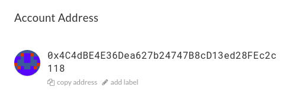
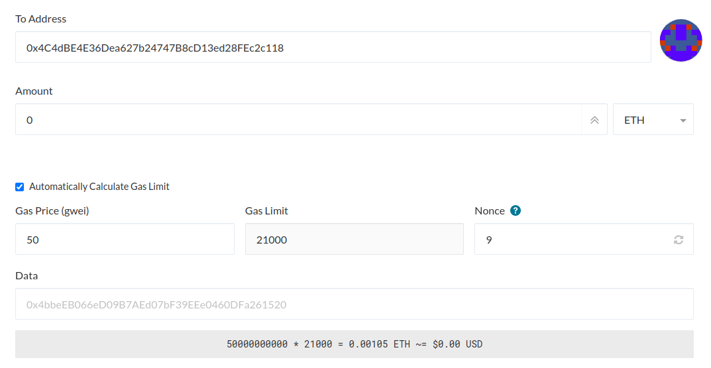

In certain cases you may want to *cancel* or *replace* a transaction, for example, when you used a gas price that was too low. Especially in times when gas prices are relatively high, you may want to increase the gas price of your transaction, to make sure it will be confirmed quickly.

* **Cancel**: Sending a transaction with a value of 0 ETH to your own Ethereum address, with the purpose of preventing your previous transaction from being confirmed.
* **Replace**: Sending the same transaction to another Ethereum address, with the purpose of doing something (e.g. sending Ether or tokens, ...).

This works by sending a transaction with the same nonce as your previous transaction. Transactions must be confirmed in the order of the nonce, starting from 0, so if you re-submit a transaction with the same nonce and a higher gas price, your previous transaction will be overwritten. There is still a chance that your previous transaction is confirmed first, in which case  the replacement transaction will be invalidated.

Below you will find a step by step instruction on how to replace or cancel your transaction.

1. First, check the status of your transaction on [the transaction status page](https://mycrypto.com/tx-status). Simply enter your transaction hash, and click the button to check the transaction. If your transaction is pending, you can cancel your transaction.

   * If you see "Transaction Not Found," and your transaction is over 24 hours old, it's possible that the transaction is no longer in the "mempool" of our Ethereum nodes. You can check the status of your transaction on [Etherscan](https://etherscan.io/).

2. On the transaction status page, you should see the nonce and gas price of your transaction. Take note of these numbers, as you will need them later.

3. Go to [MyCrypto.com](https://mycrypto.com/), or open the desktop app, and unlock your account. Then, go to the "Send Ether & Tokens" page.

The next steps depend on whether you want to cancel or replace a transaction.

## Cancelling a Transaction

1. In the "To Address" field, enter your own Ethereum address. You can find this under "Account Address" on the right side of MyCrypto.

   

2. In the "Amount" field, enter 0.

3. Click on "+ Advanced" to show the advanced transaction setting, and enter the nonce of the transaction you want to cancel in the "Nonce" field.

4. Enter a gas price that is **higher** than the gas price you used previously. If you are not sure what to enter, you can check the recommended gas price on [ETH Gas Station](https://ethgasstation.info/). Do not enter anything in the data field.

5. You should now have something like this:

   

   Go ahead and send the transaction with the "Send Transaction" button. You can check the status of your new transaction on Etherscan, or on [the transaction status page](https://mycrypto.com/tx-status).

## Replacing a transaction

1. In the "To Address" field, enter the same address as used in your original transaction.

2. In the "Amount" field, enter the same amount as used in your original transaction. If you are sending tokens, make sure to select the token.

3. Click on "+ Advanced" to show the advanced transaction setting, and enter the nonce of the transaction you want to cancel in the "Nonce" field.

4. Enter a gas price that is **higher** than the gas price you used previously. If you are not sure what to enter, you can check the recommended gas price on [ETH Gas Station](https://ethgasstation.info/).

5. If your original transaction was sent to a contract, and **is not a token transaction**, enter the original data value in the "Data" field.

6. You should now have something like this:

   

   Go ahead and send the transaction with the "Send Transaction" button. You can check the status of your new transaction on Etherscan, or on [the transaction status page](https://mycrypto.com/tx-status).

If all went well, your original transaction should be cancelled or replaced once the new transaction is confirmed.

## Related articles

* [You can learn more about gas & gas limit vs gas price here.](/general-knowledge/ethereum-blockchain/what-is-gas)
* [You can learn more about nonce here](/general-knowledge/ethereum-blockchain/what-is-nonce)
