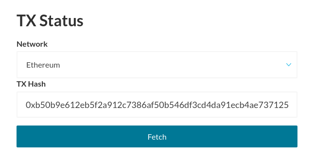
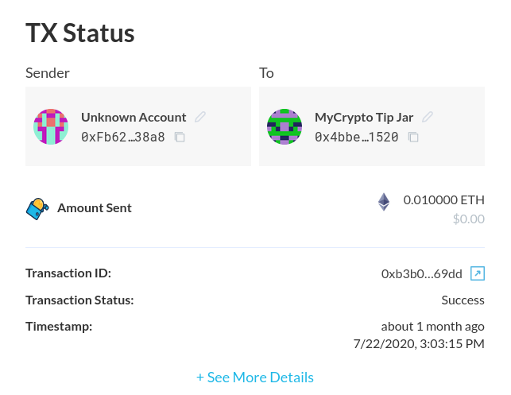
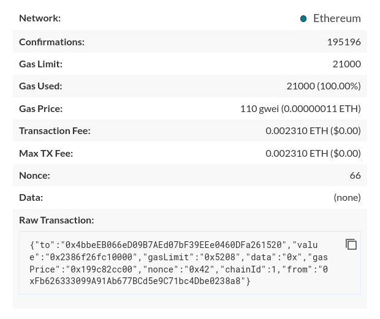
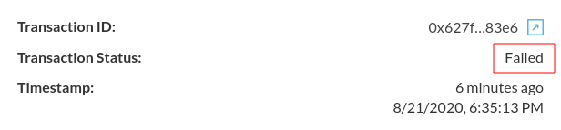
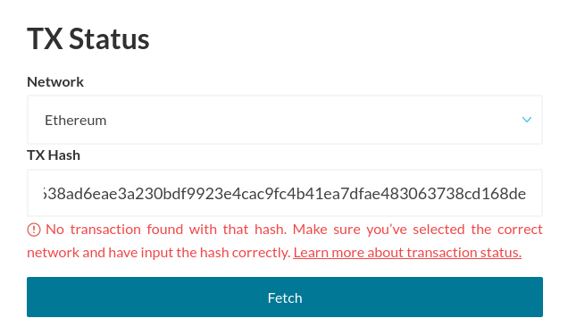

<Alert>

While [mycrypto.com](https://mycrypto.com/) also supports checking transactions, this improved version is currently only found on MyCrypto beta, which you can find at [beta.mycrypto.com](https://beta.mycrypto.com/).

</Alert>

The MyCrypto transaction status feature allows you to view the status of previously sent transactions, as well as various transaction information, such as [Gas Limit](/how-to/sending/how-to-know-what-gas-limit-to-use) used, [Gas Price](/how-to/sending/how-to-know-what-gas-price-to-use) used, and [Nonce](/general-knowledge/ethereum-blockchain/what-is-nonce). The feature is available at [beta.mycrypto.com/tx-status](https://beta.mycrypto.com/tx-status). In the near future, you'll be able to speed up a transaction from this page as well.

## Viewing transaction info

To get started, simply go to [beta.mycrypto.com/tx-status](https://beta.mycrypto.com/tx-status), select the network of the transaction that you wish to check, and enter your transaction hash.

After clicking "Fetch," all the information that MyCrypto knows about this transaction will be shown. If you have labeled your addresses, it will also be shown in this overview.

By clicking "+ See More Details," additional info will be shown about this transaction.

## Transaction status

If the transaction status shows "Success," it means that the transaction went through successfully, without any issues.

 However, if you see "Failed," it means that something went wrong and that the transaction was not executed. To find more information about what went wrong you can click the button next to the Transaction ID, which will take you to Etherscan, where you can find more information about why the transaction failed.

## No transaction found

If you see this error after entering a transaction hash, it means that it was not found in MyCrypto's nodes. This could have a few different reasons:

* The transaction was pending for a long time, most likely because of a too-low [Gas Price](/how-to/sending/how-to-know-what-gas-price-to-use), resulting in it no longer being in the [mem pool](/general-knowledge/ethereum-blockchain/what-is-gas).
* The transaction hash you entered is part of a different network, try selecting a another one.
* The transaction hash you entered was invalid.
