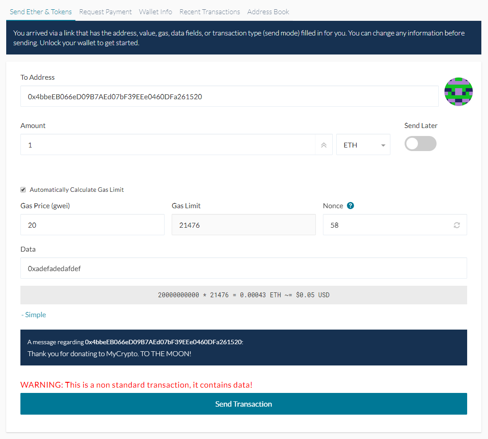

Pre-filled transactions can be created by appending certain parameters into the query section of a URL.

Pre-filled transactions are a helpful function that allow for many things, including sending transaction requests to others! Instead of telling someone "Okay, send **this** amount to **this** address on **this** network with **this** data, etc. etc.," it allows you to take all the criteria for the transaction and package it up into one neat URL that you can send to someone.

If you create a pre-filled MyCrypto transaction URL and send it to someone, they can input the URL into their browser and it'll automatically take them to the MyCrypto send page and fill it out with the specified parameters.

<Accordion>
<AccordionItem title="MyCrypto Beta">

## Parameters

<Alert>

These parameters only apply on MyCrypto beta, which you can find at [beta.mycrypto.com](https://beta.mycrypto.com/).

</Alert>

* `type` - The type of pre-filled transaction (use **resubmit** in most cases).
* `gasPrice` - The *gas price* of the transaction (should be in hex wei format. ex: **0x059682f000**).
* `gasLimit` - The *gas limit* field of the transaction (should be in hex format. ex: **0xcb56**).
* `chainId` - The *chainid* of the network the transaction should be conducted on (ex: **1**).
* `value` - The *value* of the transaction (should be in hex wei format. ex: **0x8AC7230489E80000**).
* `nonce` - The *nonce* field of the transaction (should be in hex format. ex: **0xD8**).
* `to` - The *to* address of the transaction.
* `from` - The *from* address of the transaction (should correspond to one of the accounts you have added to your dashboard).
* `data` - The *data* field of the transaction (should be in hex format. ex: **0xa9059cbb0000000000000000000000005dd6e754d37bababeb95f34639568812900fec79000000000000000000000000000000000000000000000104f6e0a229913de8a2**).

### Examples

ETH Transaction

<https://app.mycrypto.com/send?type=resubmit&gasLimit=0x5208&chainId=1&nonce=0xD8&gasPrice=0x059682f000&from=0x5197B5b062288Bbf29008C92B08010a92Dd677CD&to=0x5197B5b062288Bbf29008C92B08010a92Dd677CD&value=0x8AC7230489E80000&data=0x>

ERC20 Transaction

<https://app.mycrypto.com/send?type=resubmit&gasLimit=0x5208&chainId=1&nonce=0xD8&gasPrice=0x059682f000&from=0x5197B5b062288Bbf29008C92B08010a92Dd677CD&to=0x6B175474E89094C44Da98b954EedeAC495271d0F&value=0x0&data=0xa9059cbb0000000000000000000000005197B5b062288Bbf29008C92B08010a92Dd677CD000000000000000000000000000000000000000000000104f6e0a229913de8a2>

</AccordionItem>
<AccordionItem title="MyCrypto.com">

## Parameters

- `to` - The _To_ address of the transaction.
- `value` - The _Value_ of the transaction (in Ether).
- `data` - The _Data_ field of the transaction (should be in hex format).

### Example

<https://mycrypto.com/account/send?&to=0x4bbeEB066eD09B7AEd07bF39EEe0460DFa261520&value=1&data=0xadefadedafdef>

Breaking this down, the transaction will have:

- A send _To_ address = `0x4bbeEB066eD09B7AEd07bF39EEe0460DFa261520`.
- A _Value_ = `1` Ether.
- A _Data_ field = `0xadefadedafdef`.

After accessing your address, this will open with the pre-filled transaction screen:

### Additional notes

- mycrypto.com does not support setting _gas price_, _gas limit_ or _nonce_ because we auto-calculate those fields.
- mycrypto.com does not support the _tokenSymbol_ and _sendMode_ token parameters.

</AccordionItem>
</Accordion>

## Related articles

- [What is Gas](/general-knowledge/ethereum-blockchain/what-is-gas)
- [What are pre-filled transactions](https://ethereum.stackexchange.com/questions/27909/how-to-prefill-fields-on-myetherwallet-with-given-receiver-address-amount-and)
