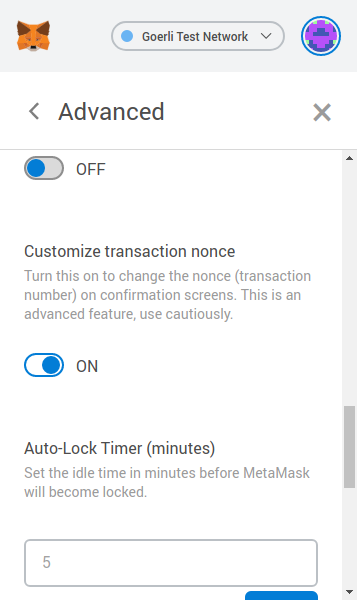
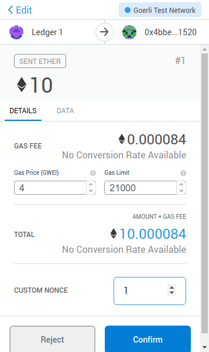

If you're using a Web3-compatible app like MetaMask to connect to MyCrypto, it's not possible to change the nonce in MyCrypto directly. Most Web3 apps change the nonce provided by MyCrypto, even when it's manually set. Below you'll find instructions for setting the nonce in the Web3 app directly.

<Accordion>
<AccordionItem title="MetaMask">

To change the nonce in MetaMask, you have to enable this option first. In MetaMask, go to Settings, Advaned, and scroll down until you see "Customize transaction nonce." Make sure this option is enabled.

Now you can go to MyCrypto and send a transaction. When MetaMask asks you to confirm the transaction, you will see a "Custom Nonce" field. Enter the nonce you would like to use here, and click on "Confirm."

</AccordionItem>
<AccordionItem title="Other">

If the app you're using is not listed above, it may still have a setting for a custom nonce. You will usually find it in the settings, or on the transaction confirmation page itself. If you need help, feel free to reach out to us!

</AccordionItem>
</Accordion>
