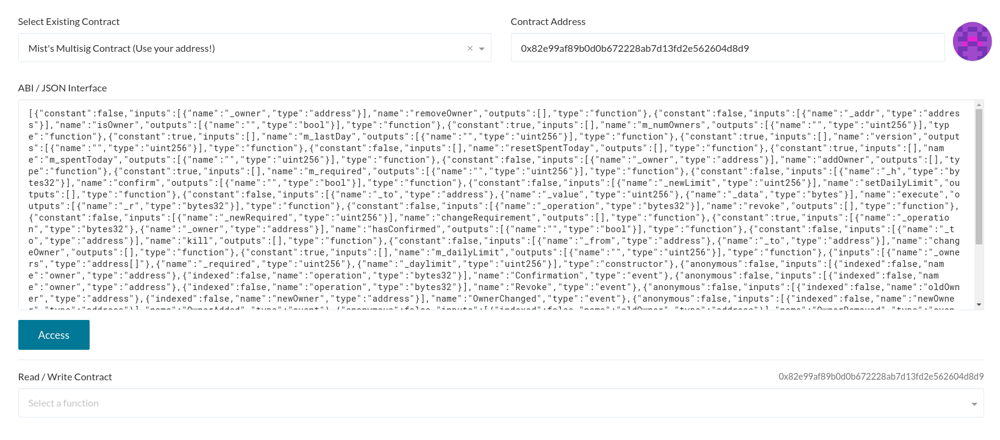
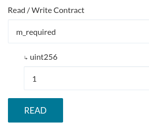
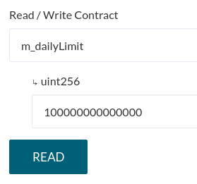
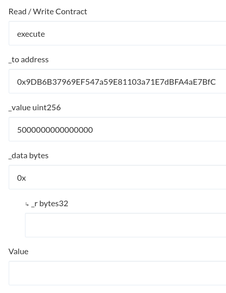
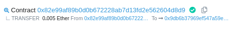
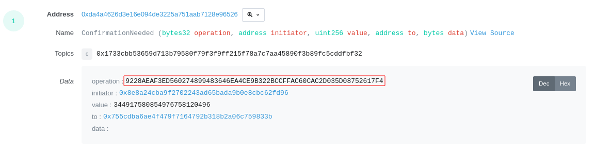
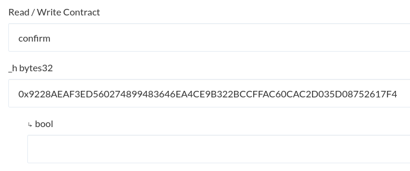
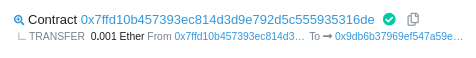

Since the [deprecation of Mist](https://medium.com/@avsa/sunsetting-mist-da21c8e943d2) in 2019, many people with funds in their Mist multisig contracts were seemingly left stranded, as Mist was the only maintained application that supported sending from these multisig contracts.

As Mist is no longer maintained, it is no longer recommended to be used. If you wish to manually transfer funds out of your Mist multisig contract, you can use the following instructions to do so.

## Ownership and daily limits

When you initially set up your multisig through Mist, it asked you to enter a list of owner addresses, a daily spending limit, and a required amount of confirmations a transaction would need before it would get sent from the multisig.

The daily limit that you specified when creating the multisig indicates how much ETH (in Wei) can be spent from the multisig a day without any additional confirmations from other owners. This may also be set to 0, meaning that every transaction will always require confirmation from other owners.

For example, you might have set it up to have three owners, and a required amount of two confirmations. This means that two owners would have to agree to a transaction if it's above the daily spending limit. The first one can be yourself, but then you would need one other confirmation. If you own all the addresses that have ownership, and still have access to these addresses, it wouldn't be an issue. However, if other people are the other owners of the multisig contract, you will need to coordinate a confirmation with one of them in this case, otherwise you will not be able to withdraw any funds.

## Accessing the multisig

1. Go to the [contract tab on MyCrypto](https://mycrypto.com/contracts/interact).
2. From the dropdown, select "Mist Multisig Contract", then enter the address of your multisig contract.
3. Click the blue "Access" button. A dropdown menu should appear, with various functions of the contract.

4. If you are unsure how many confirmations your multisig requires, you can select the `m_required` function of the contract. Click "READ", and it should show you how many ownership confirmations this multisig contract requires.

5. If you aren't sure what the daily limit of the multisig contract is, you can select the `m_dailyLimit` function, and click "READ". You will get the result back in Wei, which you can convert to Ether using the tool in [this](/general-knowledge/ethereum-blockchain/what-are-the-different-units-used-in-ethereum) article.

## Sending a transaction

1. Select `execute` from the dropdown.
2. Enter the address you want to send to in the `_to` field.
3. Enter the amount you want to send in the `_value` field. This field asks for a value in **Wei** format, not Ether. You can convert your Ether value to Wei by using the tool in [this](/general-knowledge/ethereum-blockchain/what-are-the-different-units-used-in-ethereum) article. *It is recommended that you test with a small amount first!*
4. Enter `0x` in the `data` field.
5. Leave the `Value` field empty. We are using the `_value` field to enter the amount that we wish to withdraw.
6. Be sure to review all your inputs correctly. In this example, 0.005 Ether is being withdrawn.

7. Unlock the owners address and click the `WRITE` button.
8. Click the `Generate Transaction` button & confirm & send.
9. Copy the transaction hash that MyCrypto gives you, and open the link to the Etherscan page that appears in the green bar at the bottom of your screen.

If your multisig contract only requires one confirmation, you will see that the amount you specified in the previous steps will be withdrawn right when the transaction has been mined, as this already counts as the first confirmation.

The same applies if you are sending a transaction that is below the daily limit that you initially set when you created this multisig. You can check the daily limit (in Wei) by using the `m_dailyLimit` function of the contract.

If you wish to also withdraw tokens from the multisig contract, you can find our guide on doing so [here](/how-to/sending/how-to-send-tokens-from-a-multisig-contract).

## Confirming a transaction

In case you're trying to send a transaction which is above the daily spending limit, or if the daily spending limit is set to 0, you will need additional confirmations from other owners to have the transaction go through, depending on how many is required by your multisig contract.

1. Refresh the page and select the Mist multisig once again, and enter your multisig contract address. This time, choose the `confirm` function of your multisig contract.
2. In the previous steps, you opened an Etherscan page of the transaction you've sent to the multisig contract. It should look similar to [this](https://etherscan.io/tx/0x0c643a1ae66637217f24791df05071c7849941a1231cf9fa2a0daf145da833e3) transaction. Click the `Logs` tab at the top.
3. Find the `ConfirmationNeeded` log of this transaction. Copy the hash next to `operation`, highlighted in red. This hash will be different for your transaction.

5. Go back to MyCrypto, and enter the hash that you just copied, with `0x` in front of it, in the `_h` field.

6. MyCrypto will now ask you unlock your address. Keep in mind that this has to be done from the address of a **different owner**, not the one you sent the previous transaction with. After unlocking, you can leave the `Value` field empty.
7. Generate & send the transaction.

If your multisig requires more confirmations, you will have to repeat the confirmation process for each owner until it reaches the necessary approvals. Luckily, the `_h` value is the same for each of them. Once you have reached the minimum required amount of confirmations, you will be able to see that the transfer has been made ([example](https://etherscan.io/tx/0x47e4cc8748e296d9b5d85ebd9bd705177bb1940517b084a2efcca11feeb2391d)).

