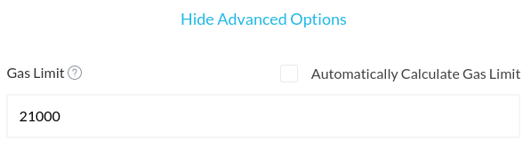
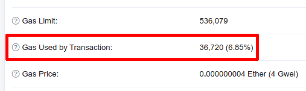

If you send a transaction with a gas limit that is too low, you may run into the following error: "Warning! Error encountered during contract execution [Out of Gas]." Each transaction on the blockchain requires gas, and the higher the complexity is of the transaction, the more gas it needs.

A standard Ether transaction from one address to another address (without contracts or data involved), uses exactly 21,000 units of gas. Other transactions, such as token transactions or contract interactions, use more gas, depending on how the contract is built. MyCrypto will automatically try to estimate the gas limit required for your transaction, but may get it wrong in some situations, in which case the error above occurs.

## How to set the gas limit

To change the gas limit for your transaction, click on "Show Advanced Options" on the transaction screen. To set the gas limit, you have to uncheck the "Automatically Calculate Gas Limit" checkbox.

Then you will be able to enter the gas limit in the "Gas Limit" field.

## What gas limit to use

There's a few ways to determine the gas limit to use. The easiest way is to take the estimated gas limit, and add a certain amount to it (e.g. 50,000 or 100,000). Then, simply enter that value in the "Gas Limit" field. You only pay for the gas used by your transaction, so any excess gas is sent back to you.

Alternatively, you can look at other transactions to the same token or contract. [This GNT transaction](https://etherscan.io/tx/0xb5bfcbc1e742018cdd0cca29e8215c1dbe377ff52c71ca6dee2f9d47b6737ff0) for example, used a total of 36,720 units of gas.

The gas used by a transaction may vary slightly, so you can use something that is slightly higher than the gas used by the transaction, like 50,000 in this case.

## Related articles

- [What is Gas?](/general-knowledge/ethereum-blockchain/what-is-gas)
