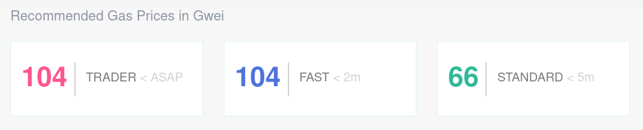

The gas price determines how much you pay per unit of gas. A higher gas price will mean that your transaction is confirmed faster, but will cost more, and a transaction with a lower gas price will take longer to confirm, but will cost less. The average gas prices can fluctuate a lot, and using a gas price that is too low, may result in your transaction being stuck. In this article, you'll find some recommendations on what gas price you should use.

In general, the higher the gas price, the faster your transaction will go through. This doesn't mean you should use the highest possible gas price all the time, as you will end up paying a lot more per transaction. MyCrypto will automatically determine the "best" gas prices, based on current network activity.

You can also manually enter a gas price, by clicking on "+ Advanced". We recommend that you use [ETH Gas Station](https://ethgasstation.info/) to see the current recommended gas prices. It will show three options:

- **Trader**: as soon as possible.
- **Fast**: takes about 2 minutes or less.
- **Standard**: takes about 5 minutes or less.

Note that the recommended gas prices can change very quickly in times with lots of network activity.

## Minimum gas price

As explained in [our "What Is Gas?" article](/general-knowledge/ethereum-blockchain/what-is-gas), the transaction fee is paid to the miners directly. Miners can set a minimum gas price for each transaction, which can differ per mining pool. You should make sure that your gas price is above the minimum gas price, to ensure that your transaction will be mined.

You can see the minimum gas prices accepted by miners on [ETH Gas Station](https://ethgasstation.info/).
