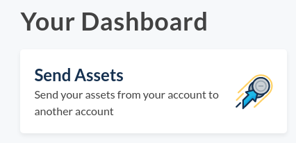
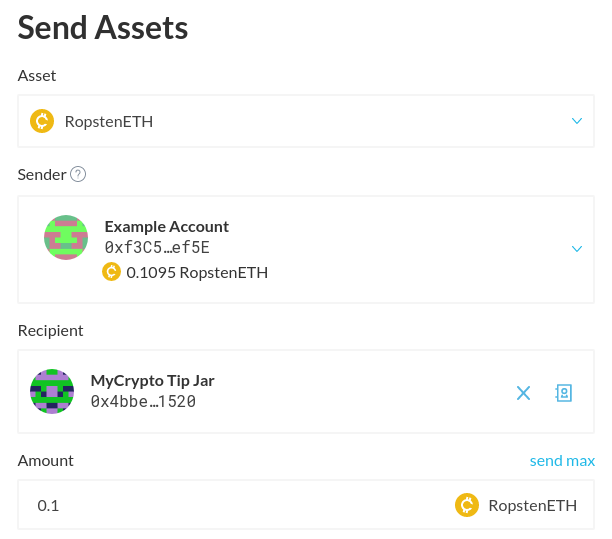
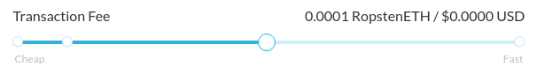
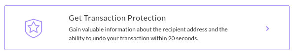
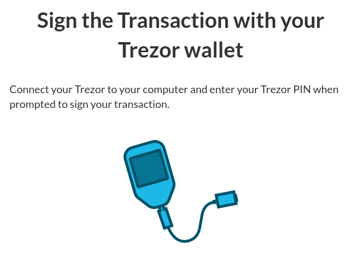
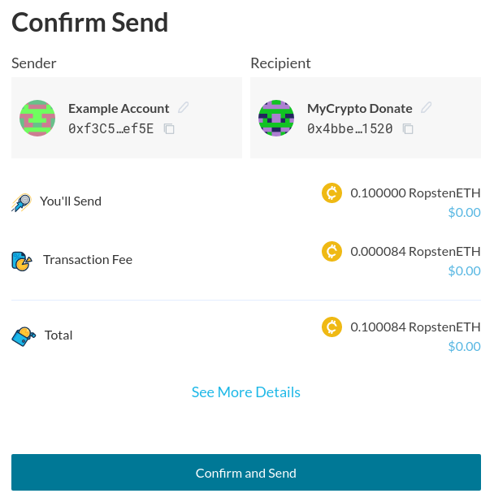

If you plan to move a large amount of Ether or tokens, you should first send a test transaction of a small amount to the destination wallet to ensure everything goes as planned.

Optional, but **highly recommended** (if you haven't already): Install [MetaMask](/how-to/migrating/moving-from-mycrypto-to-metamask) or the [EtherAddressLookup Chrome Extension](https://chrome.google.com/webstore/detail/etheraddresslookup/pdknmigbbbhmllnmgdfalmedcmcefdfn?hl=en-GB) to protect yourself from malicious websites around the crypto-space that will steal your private keys. Or even better, think about [getting yourself a hardware wallet](/staying-safe/hardware-wallet-recommendations). If you have hundreds or thousands of dollars online, you might as well spend a little bit more money to ensure that your funds are safe.

In your dashboard, after having added your address(es), click the "Send Assets" button.

Select the asset that you would like to transfer, the address which you would like to send _from_, recipient address which you would like to send _to_, and the amount of the asset which you will be sending.

The transaction fee slider allows you to choose how quickly your transaction is mined. Keep in mind that with a higher value, your transaction will get mined quicker but will cost more too. [You can find more info about Gas Price here](/how-to/sending/how-to-know-what-gas-price-to-use).

Additionally, you can choose to protect your transaction. [You can find more info about Protected Transactions here](/general-knowledge/about-mycrypto/what-are-protected-transactions).

Click the blue "Next" button to proceed.

Depending on how you initially added the address that you are sending from, you will have to sign the address from your hardware wallet, Web3 or WalletConnect instance.

After signing your transaction, you will get an overview of the transaction that you are about to send. If everything looks good, hit "Confirm and Send".

Your transaction is on its way!
