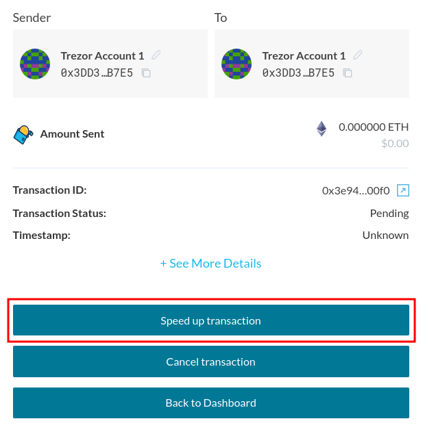
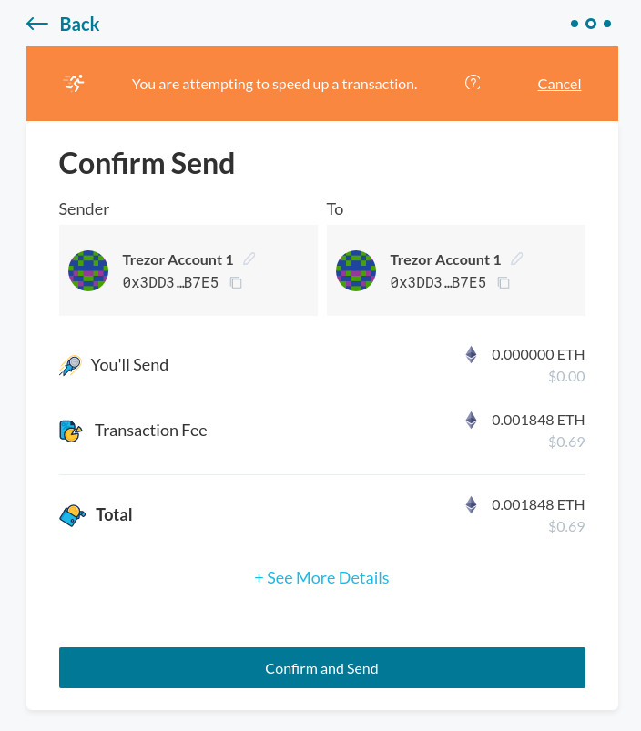

During times in which the Ethereum network is busy, you might notice that transactions can take longer than expected to confirm. With MyCrypto, it's possible to speed up these transactions to make sure that your funds quickly arrive where you want them to be.

Please keep in mind that at this time, it is only possible to speed up transactions that were not conducted with a Web3 provider such as Metamask. See [here](https://metamask.zendesk.com/hc/en-us/articles/360015489251-How-to-Speed-Up-or-Cancel-a-Pending-Transaction) if you wish to speed up a transaction that was performed through MetaMask.

Either after sending a transaction, or after [checking the status](/how-to/sending/checking-the-status-of-a-transaction) of your transaction, you will see an option to speed it up.

After clicking the "Speed up transaction" button, you'll see that you will re-send the previous transaction, but with a higher [Gas Price](/how-to/sending/how-to-know-what-gas-price-to-use).

Make sure that everything seems right, and hit "Confirm and Send". Your updated transaction will then be on its way, and should be mined shortly.
