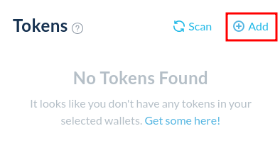
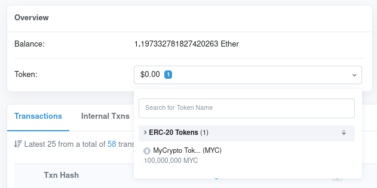
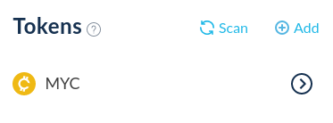

If you can't see a token when you access your address with MyCrypto, you simply need to add it as a custom token to your interface. MyCrypto ships with a list of tokens that it will automatically scan your address for, which is regularly updated. However, it may happen that a new token is not on this list just yet, in which case you will have to manually add it to your interface.

Any ERC-20 token can be added to your local MyCrypto interface by following these instructions.

Your tokens should appear if the token is on our token list. If you have a balance, you won't have to load it again — it will automatically load in the future.

If you are missing a token, click the "+ Add" button on the left-hand side of the interface, which will bring up the fields below.

## Adding a custom token

To add a custom token, you will have to find the contract address of the token that you would like to add. You can use Etherscan to find this address.

Copy the Ethereum address that holds the token that you would like to add, and enter it on [etherscan.io](https://etherscan.io/).

Click the token balance drop-down, and a list of tokens that your address holds will show up. Click the token that you would like to add to your MyCrypto interface.

Then, copy the contract address of this token, highlighted in red.

Enter the symbol (name) of the token in the `Symbol` field, the contract address in the `Address` field, and the amount of decimals of the token in the `Decimals` field. Make sure that the correct network is selected as well.

If there is an issue with adding a custom token, try adding it again but suffixing the name with `-1`. For example, `MYC` becomes `MYC-1`.

Click the `Add Token` button, and your custom token will now be shown in your interface. You can now interact with it like any other token.

## Hiding a custom token

You can hide token balances by expanding the Balance Breakdown and clicking the ( - ) icon to hide them. You can un-hide tokens in the Settings page.

Hiding tokens will merely remove the visibility of these tokens. It will not delete or remove the token from the address itself.
