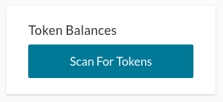
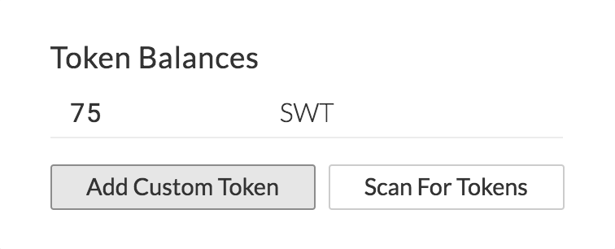
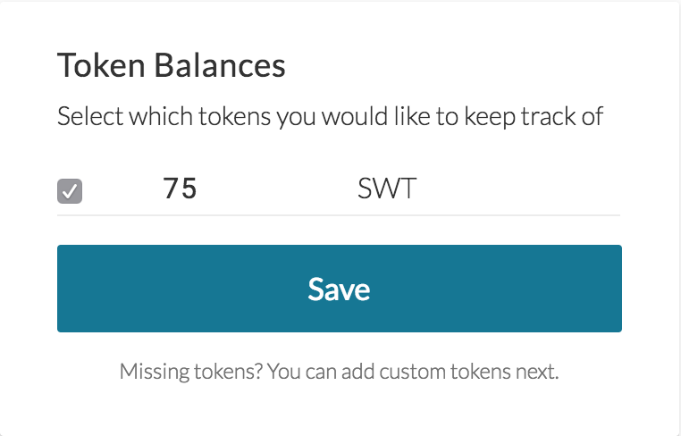
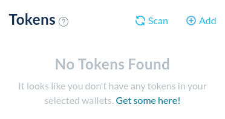

## How to load token balances

1. Click the "Scan for Tokens" Button. 

2. It will scan for all tokens in your account. Your tokens should appear if the token is on our token list.

3. If you would like to load that token each time you visit [MyCrypto.com](https://beta.mycrypto.com/account), check the box next to the token and press "Save."

4. If a token you would like to see or send is not showing up, you will need to add it as a custom token. Click [here](/how-to/tokens/how-to-add-a-custom-token) for instructions on how to add a token.

5. If you have a balance, you won't have to load it again—it will automatically load in the future! Yay!

## Related Articles

* [Adding a Custom Token](/how-to/tokens/how-to-add-a-custom-token)
* [Receiving Tokens](/how-to/tokens/how-to-receive-tokens)
