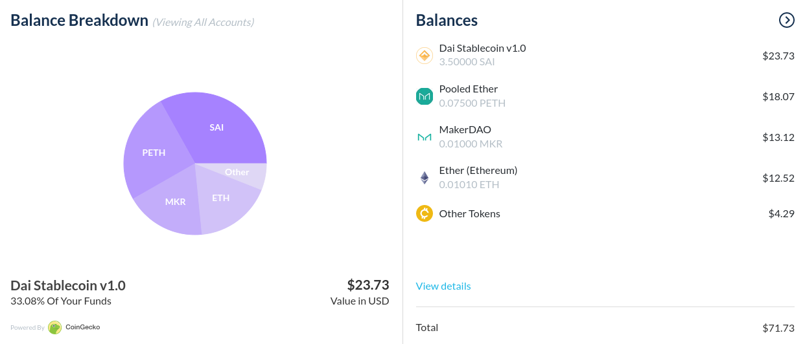
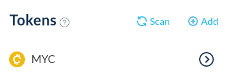

Upon adding your addresses to your MyCrypto interface, any tokens your addresses hold will automatically be shown in the balance overview.

You can also find a list of tokens that your addresses hold in the "Tokens" section, on the left-hand side of the interface.

If a token you would like to see or send is not showing up, you will need to add it as a custom token. [You can find instructions on how to add a custom token here](/how-to/tokens/how-to-add-a-custom-token).

