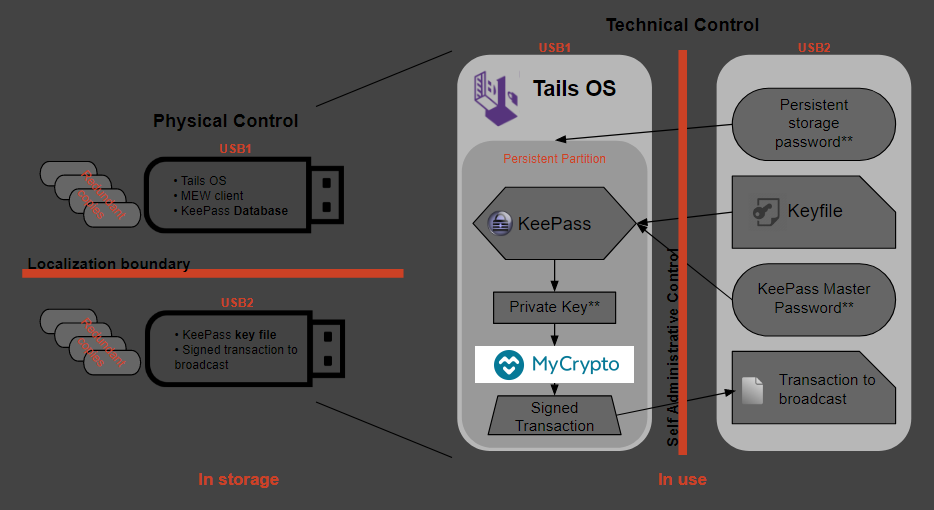
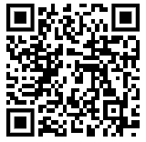
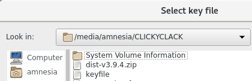
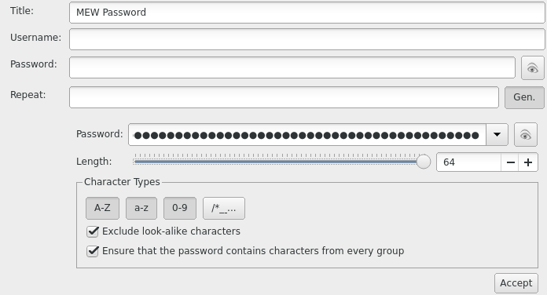
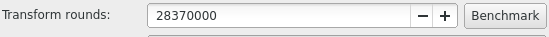
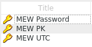
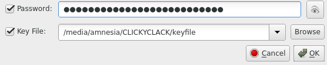

This is the updated version of the original post on Steemit [here](https://steemit.com/cryptocurrency/@tomshwom/tomshwom-s-advanced-crypto-security-guide-part-3-creating-a-secure-wallet).

By [/u/AtLeastSignificant](https://www.reddit.com/user/atleastsignificant).

## Purpose

In this guide, we are going to create a customizable wallet solution that is cheap, secure, and not too complicated. While simply following the steps in this guide will give you a wallet that is resistant to malware and other online threats, it does not guarantee total security of your funds. To be truly secure, you must follow the guidelines for how to actually maintain and use the wallet properly.

I highly recommend looking at [part 1](https://steemit.com/bitcoin/@tomshwom/tomshwom-s-advanced-crypto-security-guide-part-1-privacy-security-and-trust) of this guide to better understand security and privacy in cryptocurrencies.

If you're wondering about the security of existing wallet solutions, see [part 2](https://steemit.com/cryptocurrency/@tomshwom/tomshwom-s-official-security-guide-part-2-wallet-analysis) of the guide.

## Overview

I refer to this as a "wallet solution" rather than just a hardware wallet because it encompasses more than just some USB drives you stick in your computer. The way you decide to distribute the passwords and keyfiles, store the USB drives, and document your solution will all have pros and cons, and these are decisions left up for the user to determine. We will go over the security and convenience tradeoffs near the end of the guide, so I recommend you **read the entire guide _before_ you start.**

This part of the guide relies on free & open source software,[1](https://labs.riseup.net/code/projects/tails/),[2](https://keepass.info/download.html),[3](https://github.com/MyCryptoHQ/mycrypto.com/releases/latest) cheap hardware, and a bit of time in order to produce a system where sensitive data can be stored securely, accessed safely, and backed up easily. It follows the idea of security controls[1](https://en.wikipedia.org/wiki/Security_controls) to implement physical, technical, and administrative safeguards, but is left up to the user to ultimately choose which ones and how to implement them.

We are essentially creating our own hardware wallet that has multi-factor authentication built in and no single point of failure (like a backup seed). The goal is to end up with 2 USB drives (more for redundant backups) that are used for:

- Booting into a secure offline OS
- Accessing doubly-encrypted sensitive data like private keys
- Securely generating and signing transactions

The multi-factor authentication depends on how you choose to implement this system. You can have as many or few separate physical USB "keys" and passwords required to unlock your wallet as you want, and the way you backup and distribute them is also up to your discretion. Read through the rest of the guide for some recommendations and discussion about the pros and cons.

## Procedure

Read the **entire** guide first, then go through step-by-step.

### Gather Materials

- A computer with internet access capable of booting to a live OS on a USB drive (almost any PC or laptop)
- Minimum of two flash drives larger than 4GB, more for redundant backups - USB 3.0 is a bonus
- A way to view this guide and other ones I'll be linking to on a different computer during the offline portions

_Scan this QR code to follow the Steemit guide on your phone if you only have 1 computer to work from._

### Downloads

The first step is to download the MyCrypto client so we can sign transactions from the offline wallet. You can get the latest release of MC [here](https://github.com/MyCryptoHQ/mycrypto.com/releases/latest). You want the **mycrypto-vX.X.X.zip** file, not source code. You may have to go one or two releases back to find that, but [here is a link to the version I used when writing this](https://github.com/MyCryptoHQ/mycrypto.com/releases/tag/v3.12.0). **Only download from the official source.** Please verify all links before you click them. If you're looking to use this for cryptocurrencies other than Ethereum, download the appropriate wallets that support offline use now too.

Next, we need the latest release of [Tails](https://tails.boum.org/). Tails is a bootable OS that runs off a flash drive. It has lots of useful programs pre-installed, like KeePass, Tor, and even the [Electrum Bitcoin wallet](https://electrum.org/#home). Additionally, Tails is an **amnesic OS**, meaning it forgets everything you do after a restart. It does not save anything _unless you configure it correctly_. We will need to download a couple more pieces of software, but for now we move on to the Tails installation.

### Install Tails

Know that you will have to be doing this on a [recent version of Mozilla Firefox](https://www.mozilla.org/en-US/firefox/new/) if you don't want to use a torrent client. Once you're on the Tails website, follow the [Tails Installation Assistant](https://tails.boum.org/install/index.en.html). When it asks, we are going to be installing from Windows (or whatever OS you're running), **NOT** "from another Tails".

READ THE DIRECTIONS

I'm not going to cover the installation of Tails since their assistant does a much better job than I can. If you run into trouble, don't hesitate to reach out to me on reddit.

Once you have downloaded the MyCrypto client .zip archive and finished mounting the Tails .iso file using the Universal USB Installer to a USB drive, you need to shut your computer down, unplug the ethernet cable from it (or disable your wireless driver / unplug your router if you're using wireless), and then start back up. This is a precaution that you should take to avoid any sort of unwanted network traffic like malware "phoning home" and sending your keystrokes, clipboard contents, or screenshots to its host. **Always keep your internet physically disconnected when your Tails drive is in the system.**

When you start your machine back up, you can **continue with the intermediary Tails installation by going to your boot manager** and selecting the flash drive you put Tails on. If you need help with this, I suggest googling "how to boot from USB" and then the OS you're using and the model of desktop/laptop.

When you get to the Tails welcome screen, **add the additional setting to "Disable all networking"**. Continue to add this setting any time you see this option. Once you're done installing the final Tails, **follow step 7 on their guide** to create an encrypted persistent storage.

### -short aside about passwords-

**Choose an appropriate password** for the persistent storage volume depending on how you plan to store the password. You can't copy/paste this password from a secondary drive since it needs to be entered before Tails is completely loaded, so a randomized password is going to be annoying to look up and type each time.

**If you're going to store it in memory only**, I recommend using an easy-to-remember password and sharing it with a trusted party like a family member who can also remember it. You may even want to use one of _their_ memory-only passwords if they have a regular one. This is a safety measure for the case where you become unable to recall the password yourself. The better solution is to clone your Tails USB key containing the database, but create the persistent volume under a different password that your trusted party knows. They can't access the database without also having the master password and keyfile, so this should be relatively safe.

Alternatively, **if you're going to store this password in a password manager** separate from the wallet USB keys, I suggest a strong passphrase that isn't based on lyrics, books, quotes, or other publicly available works. This makes it resistant to dictionary attacks while still being long enough to avoid brute-force. Make sure the password database is stored redundantly so that it isn't lost. If the master password to this database isn't known by another trusted party, you risk losing access to your funds.

Again, it's more important that you **remember** the password easily so you don't have to write it down (where somebody could find it) or store it on another system (where it can be stolen). Being able to draw it from memory will also be convenient since you can't copy/paste it.

### Set up MyCrypto

Shut down your machine, unplug the Tails drive, and boot back into your normal OS. Either format the USB that you installed the intermediary Tails on, or get another one and put the MyCrypto mycrypto-vX.X.X.zip file on it. You can do this ahead of time if you are following my advice to read all the instructions first.

Reboot into Tails, disable networking, and enter your persistent volume password.

Plug in your second USB with the MC/MEW .zip file on it, and copy it to the persistent Tor directory. The MC/MEW client uses a browser to navigate the html files, and Tails already has Tor installed. Tor cannot access files outside of its assigned folder on Tails though, so the MC/MEW files need to be in the Tor folder located on the persistent directory if you want them to exist after a reboot and be seen by Tor.

Unzip the archive and open index.html to verify everything works. You may have to close some dialogue boxes Tor generates since you aren't connected to the internet.

### Set up KeePass

I have a very comprehensive Steemit post covering KeePass [here](https://steemit.com/security/@tomshwom/computer-hygiene-part-4-comprehensive-guide-to-keepass-password-manager) that is a good reference if this is your first time using the program or have never dug into the security settings before.

Now we need to create a password to generate our private key and UTC file using the MC/MEW client.

Run KeePass from applications (top left corner) > accessories > KeePassX.

Enter a master password that is different from the one you used for the encrypted persistent volume. This password could be memorized (taking into account the discussion above), randomly generated and stored on a drive separate from the Tails drive, or ignored completely. Obviously, choosing to ignore the password or use the same one as the persistent volume is less secure. **If you are already using a memory-only password for the encrypted volume**, I recommend using a recorded password that is stored in a separate password manager.

Click the option for a keyfile and create it. **Save this to the second USB drive, NOT the Tails drive.** Locating the other drive can be done by going to the "/" directory > media > amnesia > your drive.

### Generate Your Cold Storage Address

Create an entry for your MC/MEW password and use the password generator to give you a **long random password.**

Go back to the MC/MEW client and put this password in to generate a new wallet. Download your Keystore File.

In KeePass, open your password entry and attach the keystore file in the advanced options. Now you have your password + keystore in one place (which is equivalent to your full private key). Save your actual private key in KeePass also. Delete the keystore file, we only want it to exist in KeePass. Don't store the private key or keystore anywhere other than your encrypted KeePass database.

Before you exit KeePass, go to Database > database settings and click the "benchmark" button.

This determines how many rounds of encryption can be run on the database in 1 second. **It drastically improves the security of the database against brute force attacks** while only being slightly inconvenient (takes 1 second for decryption). **You should now have your password, MC/MEW UTC keyfile, and private key saved in the database.**

Save your KeePass Database to the Persistent Directory.

Reboot your machine back into Tails. Once you're in, launch the MC/MEW client and access your cold storage address using the **UTC + password** stored in the KeePass database. You will have to save the keystore file from KeePass to the persistent Tor directory in order for Tor to be able to use it in the MC/MEW client. Access the address again using the **private key**. Remember, you need the password and the keyfile to open the database, and you should've stored the database keyfile on the second USB.

If everything is done correctly, you should be able to access your address using the private key and the UTC keystore + password. Go through both of your drives and verify that everything is where it belongs:

### On Your Tails Drive

- Tails installed with persistent volume password stored in memory\*
- KeePass database (in persistent Tor directory) with password in a secure location\*
- MC/MEW client (in persistent Tor directory)

### On Your Secondary Drive

- Keyfile for the KeePass database
- Additional passwords\*

### On an Optional Tertiary Drive or in a Password Manager

- KeePass database backup
- KeePass keyfile\* OR KeePass password\* (never store these on one device, especially one with the database)
- Persistent volume password\*

\* only indicates recommendations, can be changed however you like for more/less security

We keep the KeePass database located on the Tails drive so that the most sensitive information (private key) is encrypted by both the database and persistent Tails volume. Separating the UTC file and password while never storing the raw private key is another option, but I don't see any additional security benefits to it.

Once you're sure that everything is set up correctly the way you want, test the address by sending a small amount of Ether (.0001) to and from the address using the offline transaction signing in the MC/MEW client. Remember to use low gas prices to save Ether.

### Review and Document the System

At this point, I recommend documenting how your system is set up so that you and/or a trusted party can access your funds if you ever forget or become unable to. These entries should have their location, quantity, and purpose recorded:

- **Tails OS with KeePass database and MC/MEW client** - stored redundantly on multiple USB drives. Recommended for database to contain MC/MEW UTC file + password and private key
- **Tails persistent volume password** - recommended to be memorized and simple, can set up secondary Tails with different password to make it easy for trusted party to also access
- **KeePass master password** - recommended to be unique and secure from brute force and dictionary attacks. Can store encrypted on a separate system unrelated to the wallet drives
- **KeePass keystore file** - recommended to be stored redundantly on multiple USB drives, encryption is a plus

### Create Backups

Now that you have things working, you can store your KeePass keyfile on other drives and locations both digitally or physically for redundancy. If it exists on an online system, it should be encrypted.

To create a backup of your Tails drive, boot into Tails and go to applications > Tails > install by cloning. Also, copy the KeePass database and MEW client from the persistent Tor directory to a temporary location on a different physical drive. Boot into the new Tails installation, set up the persistent volume again, and move the KeePass database and MEW client into it from the temporary drive. Format the temporary drive (full, not quick) to erase any traces. Look into [Darik's Boot and Nuke](https://dban.org/) for ultra secure drive wiping.

### Verify Everything

At this point, you need to take a step back and look at what you're really doing. The whole point of this guide is to give you some tools so you can decide how to arrange your system of security. For a secure system, you need to make sure of at least these things:

1. You cannot access your private keys without at least two drives and something you know
2. Gaining access to any 2/3 (or any majority) of these **does not** compromise your system
3. Loss of one of the drives does not keep you out of your system / you've made backups
4. Chances of losing all of your backups and the main drive of either the KeePass keyfile drive or the database drive is extremely unlikely because they are stored in drastically different secure environments (like a lockbox at home and a safety deposit at a bank)
5. You've tested accessing the wallet, depositing funds, and signing transaction offline to withdraw funds

## Summary

This is a lengthy guide and is intentionally vague in some areas to encourage users to put thought into it and figure it out on their own. The end result should be a sort of multi-signature, offline accessible, inexpensive, highly encrypted wallet.

It is up to the user to maintain their own protocols for accessing the cold storage wallet, namely, to only bring the separate required drives together when accessing the wallet and promptly separating them once they're done.

Creating redundant backups is highly encouraged, but don't make more than you can actually store securely. Be careful about the passwords you choose and how they are stored.
