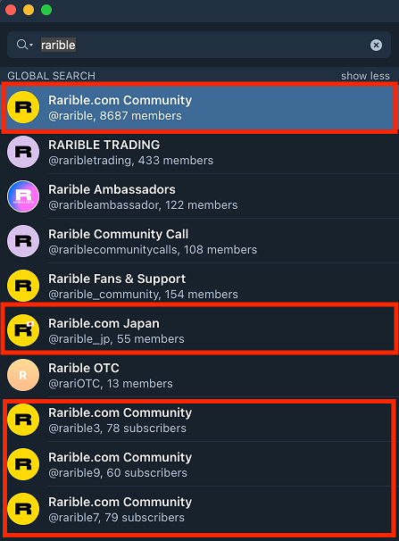
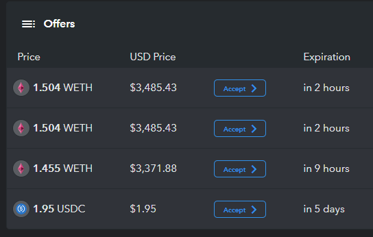

Scams have run rampant in the crypto space for years, and NFT-related scams are increasing every day. As a relatively new (and very popular) trend, it has been the target of quite a lot of scams to try to capitalize off of the hype.

**Artist impersonation**. This is where someone steals artwork from a digital artist and mints it as their own. They try to sell popular NFTs at a very low price and end up selling some before their profiles are taken down. Words of advice here: If it is too good to be true, it’s probably best to stay away from it. Second, always check to make sure that the artist you are buying from is verified (or the product from the holder is verified).

**Brand impersonation**. This has been a common scam in cryptocurrency since day one and has made its way into the NFT area as well. Never give your private keys out to anyone, never enter your private keys online anywhere, and always be aware of where you are browsing for NFTs. MetaMask has been a great tool to connect to access dapps, but be aware of what permissions you are giving these dapps. Practice proper safety and security online and you won't need to spend too much time actively worrying about this. If you find someone acting illegitimately, report the account so that you may save someone else down the road.

**Fake storefronts** will pop up using similar or keywords from the original store’s URL. The site will look similar to the website that you are familiar with and then they may attempt to trick you into buying a counterfeit NFT or give them your private key. Pay attention to the URL and how you were directed to the site, and if you come across any, report them.

**Deceitful bidding**. Once you own an NFT, you will most likely connect your wallet to OpenSea, which is a great place to browse, buy, and sell NFTs, but also contains risks to be aware of. A lousy scam that has popped up lately on OpenSea is where people will bid what you are asking to sell your NFT for, but using USDC coin - not WETH or ETH. Seems easy enough to avoid, but some scammers push this further by changing their profile picture to show the WETH logo in their photo so that you may think, “Wow, someone just bid 5.3 WETH for my piece!” without actively checking, and you quickly sell - only to find you were rewarded with 5.3 USDC. The best method for avoiding this is simple: be patient and take your time when sorting through your bids. This should be seen as common sense, but scammers do trick people this way. To escalate it one step further, head over to the Discord server of the NFT to report the person doing it and have them banned if they are there.

There are a wide variety of scams out there, but if you are aware of these common scams - you will do well in keeping yourself and your tokens safe. Having a hardware wallet will add an extra layer of security for you as well - if you have a significant investment into NFTs I would strongly recommend looking at getting a [Ledger](https://www.ledgerwallet.com/r/1985?path=/products/) or a [Trezor](https://shop.trezor.io/?offer_id=10&aff_id=1735).

## Related articles

- [Intro to NFTs & NFT token standards](/general-knowledge/ethereum-blockchain/intro-to-nfts-and-nft-token-standards)
