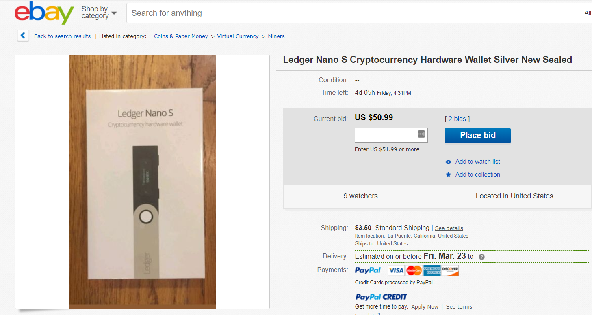

## General Tips for Securing Hardware Wallets

- Update the firmware of your device.
- Don't leave your device plugged in.
- Make sure your device is physically secure.
- Don't purchase pre-owned devices.

### Pre-owned / Used hardware wallet attacks

#### How is this done?

In this type of attack, a bad actor would purchase hardware wallets, record the private keys of these wallets, and post them for resale on Amazon or eBay. This works because hardware wallets are in demand and often-times out of stock. People are often unwilling to wait for the main distributor to have stock.

The image below shows a hardware wallet posted for resale:

#### How can I mitigate this?

Only purchase your hardware wallet from trusted sellers:

- [Ledger](https://www.ledgerwallet.com/r/1985?path=/products/)
- [Trezor](https://shop.trezor.io/?offer_id=10&aff_id=1735)
- [Keepkey](http://keepkey.go2cloud.org/aff_c?offer_id=1&aff_id=4086)

#### How can I help others to not fall for this scam?

When you find these scams, post about them on social media like Reddit and Twitter so that users can learn about their existence. You can also share this article using the sharing links below the title.

---

If you don't understand any of the terms in this article, please try referencing our [Ethereum Glossary](/general-knowledge/ethereum-blockchain/a-glossary-of-common-terms-in-the-ethereum-crypto-space).
