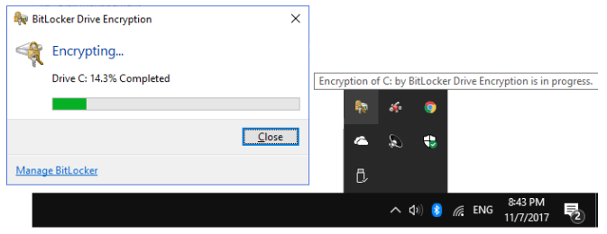
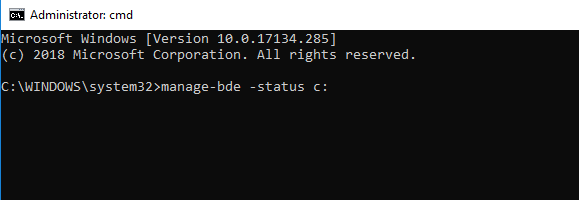
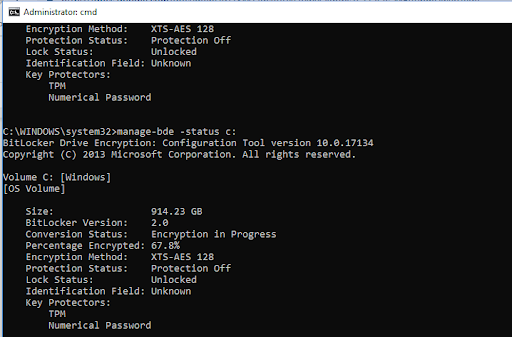

You must have Windows 10 Pro or Windows 10 Enterprise to access BitLocker.

## Back it Up!

Before encrypting your machine, make a backup to an external storage device. Make sure you leave your PC plugged in for the process, which does take some time that varies from machine to machine.
1. Open Control Panel.
2. Click on System and Security.
3. Click on Backup and Restore.
4. On the sidebar to the left, click the Create a system image.
5. Under "Where do you want to save the backup?" select the “On a hard disk” option.
6. Using the "On a hard disk" drop-down menu, select the storage to save the backup.
7. Click the Start backup button.
8. You’ll be asked if you want to create repair disc; you can but don’t have to because you’re backing up to external storage.
9. Make sure you keep the external storage device somewhere safe and offline.

## Tales from the Encryption

To encrypt using BitLocker, make sure you can leave your PC plugged in for several hours, possibly overnight. Go to Power & Sleep Settings in the start menu. Select “Never” for the Sleep option for “when plugged in.”
1. Open Control Panel.
2. Click on System and Security.
3. Click on BitLocker Drive Encryption.
4. Click Turn on BitLocker.
5. You will get a wizard to walk you through the next part. When it asks you how you would like to backup your recovery key, unfortunately, it won’t just show you the key so you can write it down. You can save it to an external storage device (click Save to a file) or print it out. If you save it to a USB. Once it’s on the USB, you can write it down on paper and keep it somewhere super safe, as if it were a private key to a wallet containing millions of dollars. Then you can delete it from the USB.
6. Choose to encrypt your entire drive (not just the used disk space).
7. Select New encryption mode.
8. Select Run BitLocker system check and then click continue.
9. Your wizard window will now disappear, but the previous window will say you need to restart the PC. Do that manually. It will take a really long time to restart.
10. When it boots back up, check your additional icons in the taskbar:

## The Waiting Game

You can check the actual status by opening a command prompt as administrator.
1. Right click on the desktop and select New and then Shortcut
2. Copy/paste this into the field: `C:\\Windows\System32\cmd.exe`
3. Click next. This will create a shortcut on your desktop to open the command prompt.
4. Right-click the new icon and select Run as Administrator
5. Copy/paste this at the command prompt: `manage-bde -status c:`

It should look like this:

6. Hit enter. It will then look something like this:

To get a new status update, hit the up-arrow key and then enter, and it will run the command again.

You can keep working while your PC is encrypting. It may take a long time but, eventually, it will say “Percentage Encrypted: 100%” and the additional icon from your taskbar will disappear.

## Changing Your Password

1. Click the Start button at the bottom left of your screen.
2. Click Settings from the list to the left.
3. Select Accounts.
4. Select Sign-in options from the menu. 
5. Click on “Change” under Change your account password.
6. Enter your current password or pin when prompted.
7. Choose a passphrase that you will remember that is at least 20-characters-long that incorporates numbers, symbols, and a combination of upper- and lowercase characters. A good site for generating random passphrases is [passwordsgenerator.net](https://passwordsgenerator.net/).

If your PC was previously set to log in with a PIN, remove it as an option by clicking Remove. It will ask for your new password.

Make sure to go back into the Power & Sleep Settings to change your sleep options back to normal.
