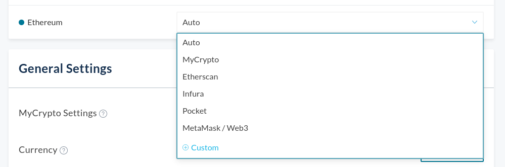
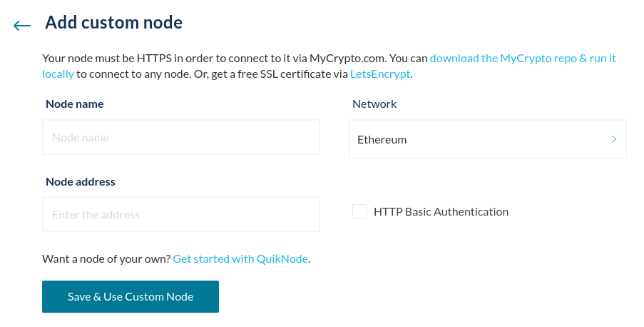
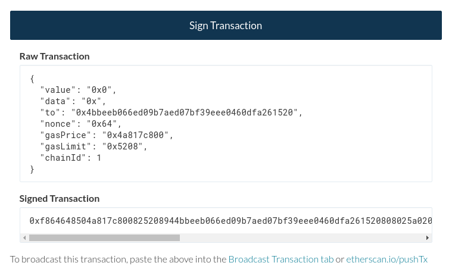

With the cryptocurrency industry growing faster than ever, it has become more and more lucrative for financial companies and institutions to know as much as possible about you and how you interact with your funds online. While [data breaches are happening left and right](https://haveibeenpwned.com/), and marketing companies are tracking your every step online, privacy has never been more important -- and has never been more difficult to achieve.

## Isn’t the blockchain anonymous?

One misconception that people often have about the blockchain is that it’s completely anonymous. Depending on the blockchain used, this or the opposite might be true.

One example of a blockchain that has a completely private transaction history is [Monero](https://www.getmonero.org/). Most prominent blockchains, such as Ethereum or Bitcoin, have all their transactions and balances on display to the public. Anyone is able to view the transaction history of every address.

However, [this data doesn’t inherently have any personal data attached to it](/general-knowledge/ethereum-blockchain/is-the-blockchain-private) unless you publicly make the connection between your name and your Ethereum address. We see this all the time with people [responding to Twitter posts](https://twitter.com/MyCrypto/status/1382776149529423873) claiming to give away stuff for free.

Even if Ethereum addresses don’t necessarily have any private data attached directly, it is still pseudonymous and only as private as you make it.

Thankfully, MyCrypto cares about your privacy and we’ve taken steps to ensure you can have as much privacy as you desire.

## Using MyCrypto privately

There's many things you can do to better safeguard your privacy online, the following are some tips we recommend while using MyCrypto.

### Use a VPN

A VPN allows you to create a connection to another network on the internet, commonly used for increased anonymity and privacy while browsing. Since your internet connection is tunneled through another network, your ISP or other possibly malicious actors within your network won't be able to see what kind of traffic is coming from your device, due to it being encrypted.

There are a plethora of different VPN providers you can use, and we highly recommend that you do some research to see which one may work best for you. VPNs have a variety of features and toolsets, and it may be helpful to [view this comparison chart](https://www.safetydetectives.com/best-vpns/#simple-vpn-comparison) to find a VPN that fits your needs.

### Use Pocket Network’s node or a custom node

By default, when you use MyCrypto you’re using one of four nodes: MyCrypto’s node, Etherscan’s node, Infura’s node, or the [recently-added Pocket Network node](https://www.blog.pokt.network/og-web3-interface-mycrypto-adds-support-for-decentralized-infra-provider-pocket-network/). These are all reliable nodes that help to keep our infrastructure up and running, but there is a difference between them; Pocket Network’s node is inherently more decentralized than the other three.

MyCrypto will automatically use one of the above four nodes, and if for some reason one of them fails, it’ll default to another. You can, however, select a preferred node for your account(s), if, for example, you’d prefer to use only Pocket Network’s node.

To change your preferred node, go to your MyCrypto settings and find the Network & Nodes section. Click the drop-down menu next to the network you would like to use.

If you don’t want to use ANY of the four default nodes, it's possible to run a custom node with MyCrypto. You can choose to get your own node with a service such as [QuikNode](/how-to/nodes-networks/how-to-use-quiknode-with-mycrypto), or run a node yourself with a client such as [Geth](https://geth.ethereum.org/).

If you’ve got the “Auto” option selected, your MyCrypto interface will automatically connect to a different node in case one goes offline or is performing poorly. After adding your own node, make sure to select the new node to override this default setting.

### Use MyCrypto offline

For increased security, you can also run MyCrypto locally on your computer, without having an internet connection. By using the [MyCrypto desktop application](/how-to/offline/how-to-run-mycrypto-offline-and-locally), you can generate new addresses and create transactions on an offline computer, after which you only have to copy the signed transaction to a computer that is connected to the internet in order to broadcast it to the Ethereum network. You’ll effectively have a wallet that’s completely air-gapped.

You can generate a new private key, keystore file, or Secret Recovery Phrase, and access this wallet with the desktop app on an offline computer. As there is no internet connection, you will have to manually fill in some fields, such as the [gas price](/how-to/sending/how-to-know-what-gas-price-to-use) and [nonce](/general-knowledge/ethereum-blockchain/what-is-nonce), that would normally be automatically retrieved from the blockchain.

After you enter your transaction details, you can sign it and receive your signed transaction hash. Next, you can manually broadcast this transaction on an online computer by using MyCrypto’s [Broadcast Signed Transaction](https://app.mycrypto.com/broadcast-transaction) page.

### Use Tails

[Tails](https://tails.boum.org/) is a Linux-based operating system that is small enough to fit on a portable USB-drive and is aimed at preserving privacy and anonymity. All internet traffic is routed through the [Tor network](https://www.torproject.org/), which allows you to anonymously browse the internet through a worldwide network of Tor relays hosted by volunteers. As MyCrypto can be used offline, you can select the “Disable all networking” setting in the welcome screen.

The operating system doesn’t store any info regarding the applications you use or any websites you might visit, but does allow you to create an encrypted, persistent volume on the drive, so you can access it next time you plug in your USB-drive. This is where you could store any passwords or private keys.

Besides Tor, Tails includes a bunch of other privacy- and security-focused programs. After you install the MyCrypto desktop application on your Tails USB-drive, make sure to store it in a safe place.

### Use a mixer

One way of improving your anonymity on the Ethereum blockchain itself would be to use a so-called mixer that allows you to anonymously send funds to another address without leaving a trail, such as the fully on-chain [Tornado.cash](https://tornado.cash/).

## Does MyCrypto share my address?

You can add multiple accounts to your MyCrypto dashboard, and your account address is utilized for a few important functions:

- Node providers need to see it to fetch balances for your funds.
- TheGraph needs to see it for queries on ENS names owned by the added accounts.
- 0x (proxied through MyCrypto's API) needs to see it for our Swap functionality.

Feel free to read our [Privacy Policy](https://mycrypto.com/privacy/) for more information on this.

Preserving your privacy online is a massive feat, and these are just some of the tips we’ve gathered to help you stay more private while interacting with your funds.

Be mindful of what information you are revealing online, and how it might be attached to your Ethereum accounts. Posting your Ethereum addresses out in the open might attract unwanted attention, and we highly recommend you try your best to [protect yourself and your funds](/staying-safe/protecting-yourself-and-your-funds).

## Related articles

- [Is the Blockchain Private?](/general-knowledge/ethereum-blockchain/is-the-blockchain-private)
- [How To Run MyCrypto Offline and Locally](/how-to/offline/how-to-run-mycrypto-offline-and-locally)
- [How Can MyCrypto Send Offline?](/general-knowledge/about-mycrypto/how-can-mycrypto-send-offline)
