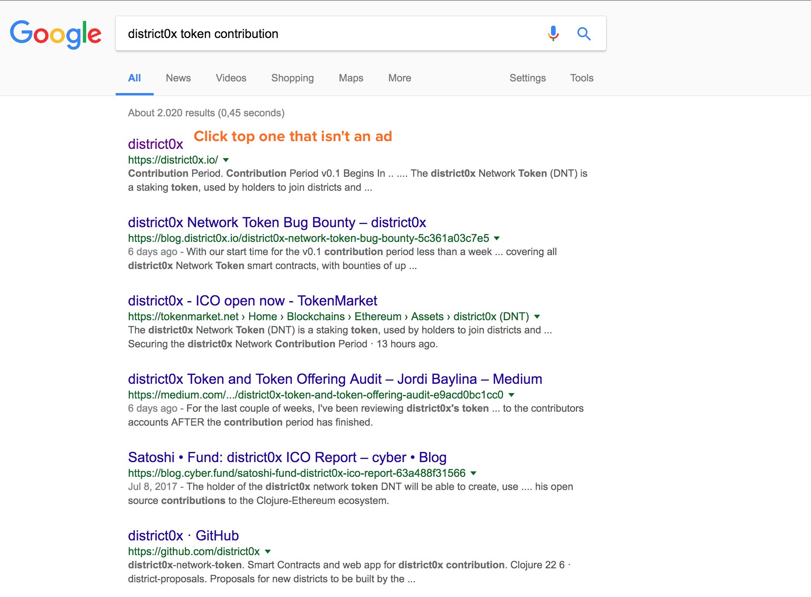
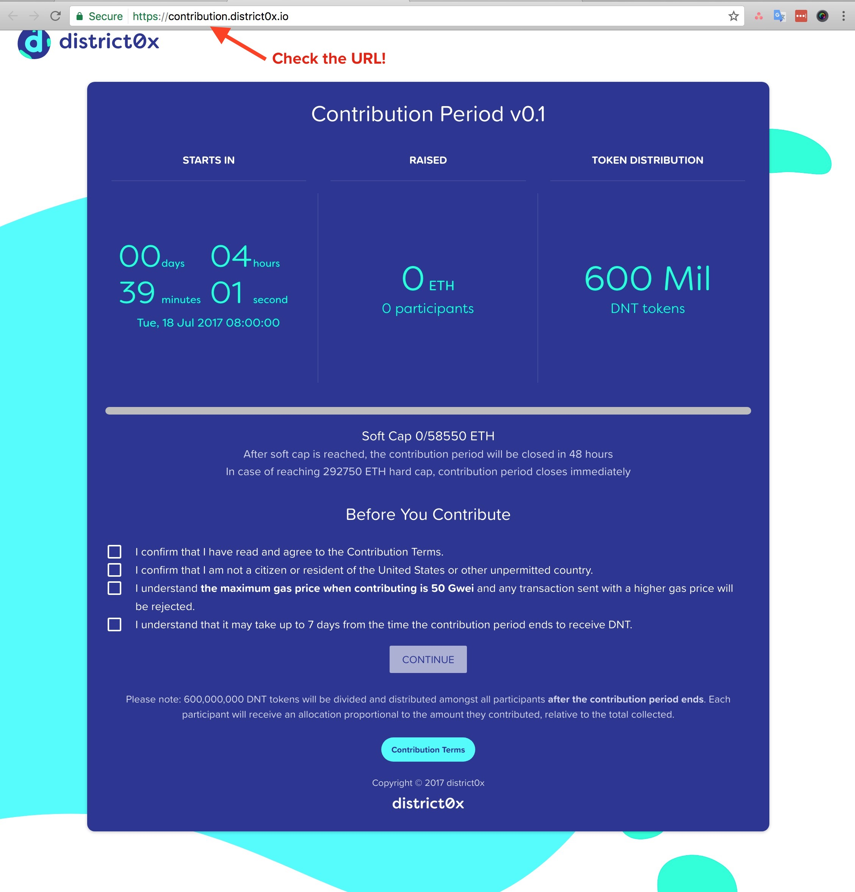
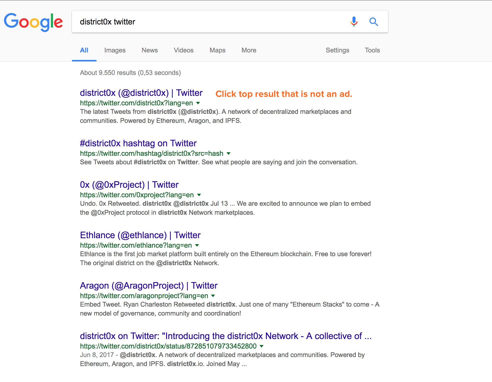
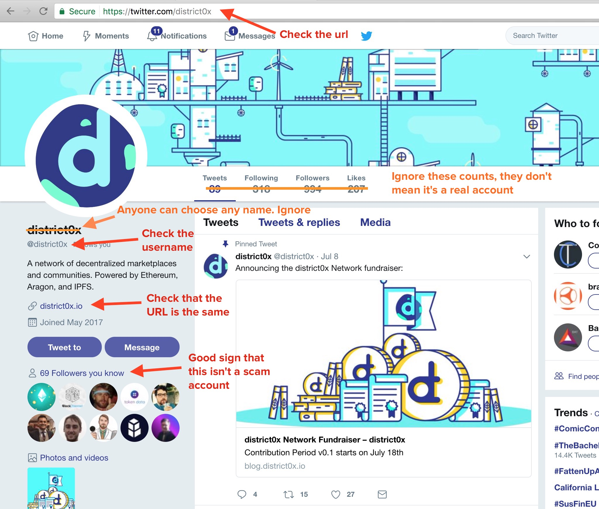
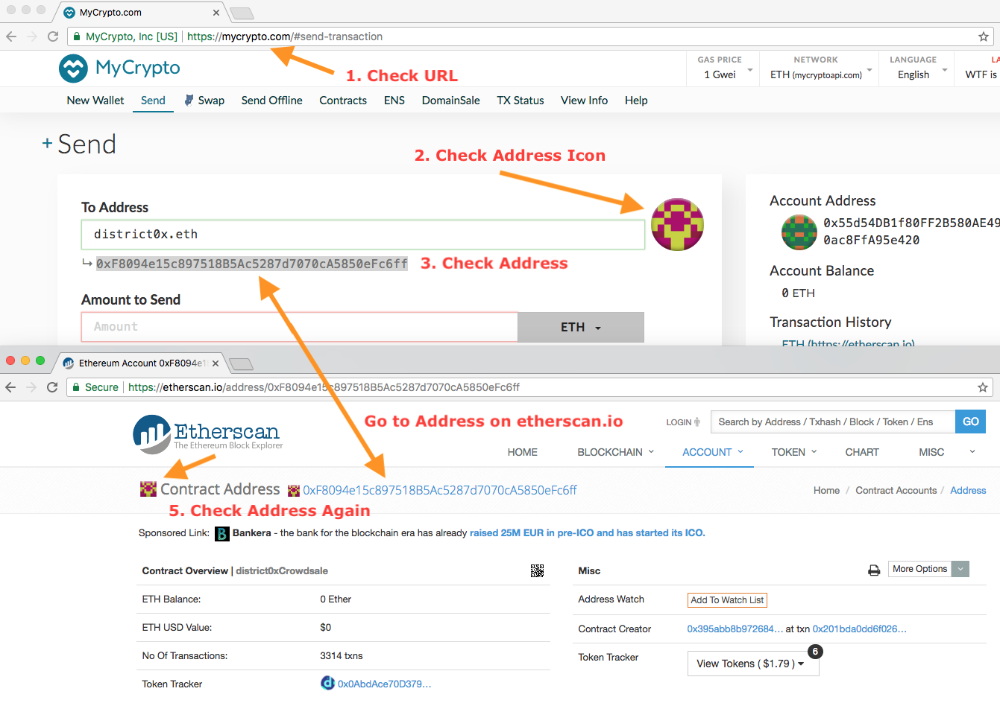
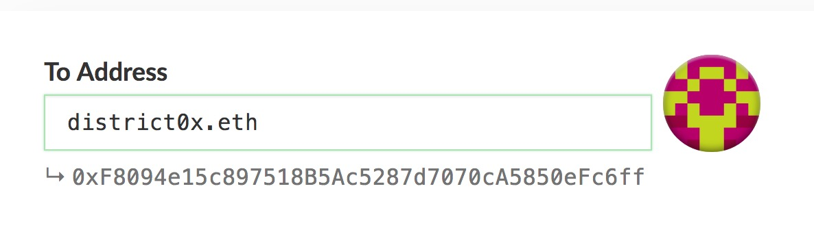

Below are some tips to reduce the risk of losing your hard-earned coins

1. Install either [EtherAddressLookup](https://chrome.google.com/webstore/detail/etheraddresslookup/pdknmigbbbhmllnmgdfalmedcmcefdfn) or [MetaMask](https://chrome.google.com/webstore/detail/metamask/nkbihfbeogaeaoehlefnkodbefgpgknn) if you use MyCrypto or other crypto-related sites. These warn you if you go to a malicious website.
2. Did you just get sent a link to a token sale, MyCrypto, EtherDelta, ShapeShift, or eBay? **Don't click it!** Instead, search for that service on Google. Click the top one **that is not an ad.**
3. You **do not** have to enter your private key for an airdrop. Don't enter your private key on random sites!
4. Double-check the URL. Are there any weird characters? Symbols? It is `shapshift` instead of `shapeshift`? Or `myctypto` instead of `mycrypto`?
5. Token sale or exchange? Google the name of the token + "twitter"
6. Check out the Twitter account. Everything looking good still? Do they still have a verified badge if they had one before?
7. Sending to an address? Check out the address on [Etherscan](https://etherscan.io). Check for "scam" warnings under the comment section.

The screenshots below point out specific things to check to make sure you are interacting with the correct site.

## 1. Use Google instead of clicking links sent to you

So you received a message, saw a tweet, or whatever about hot new ICO. Don't click. Google the name of the token + "token contribution," "Ethereum," or "token."

## 2. Check the URL. Is it the same as the message received?

Okay ... but how do I know this is the _right_ URL?

## 3. Google the name of the token + "twitter"

## 4. Check out the Twitter. Everything looking good still?

On Twitter, check the URL and the USERNAME of the account. Be on the lookout for weird things like \_ or capital "I"s that look like "l"s or "O"s that look like "0"s. This indicates a scammer.

Followers, images, tweets, and the name of the Twitter account are cloned by fake accounts. Ignore those.

If you have followers in common, this is a good sign! The URL they provided matches the URL you were on earlier. So let's get the address ...

## 5. Check out the address on [Etherscan](https://etherscan.io)

... and let's check the comments on Etherscan.

Does it have any comments? Are they all angry people who had their funds stolen?

Or is there some extra verification that this is legit? Again, never rely on a single comment—multiple indications of legitimacy are ideal.

## 6. Always make sure you are on the correct MyCrypto

When you go to contribute, make sure you are on a legit version of MyCrypto (<https://mycrypto.com/>).

Check the URL. Check the SSL (it should always say MyCrypto, Inc [US]).

Check the address. Check the identicon (the blob of colors that corresponds to your address. It is an easy way to see whether the address is consistent across multiple places).

In this case, district0x's is kinda pinky-yellow and the address starts with 0xF80.

## 7. Use protected transactions

MyCrypto can automatically check your transaction to ensure it is sent to the right person. Learn more about [how to use protected transactions](/general-knowledge/about-mycrypto/what-are-protected-transactions).

### Related articles

- ["I Got Sloppy, I Got Scammed"](https://hackernoon.com/i-got-sloppy-i-got-scammed-10e00ac0905)
