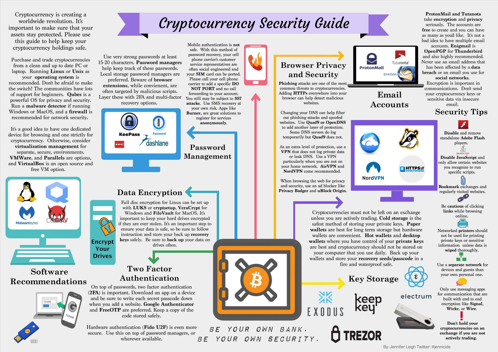

(Source: [@Jennicide](https://twitter.com/Jennicide))

## 1. Get yourself a hardware wallet.

One of the safest and easiest ways to store your ETH, Tokens, ETC, BTC, and many other coins is via a **Ledger Nano S** or **Trezor**. Both are hardware wallets. Both work with MyCrypto.com and both cost less than \$100.

- [Buy a Ledger](https://www.ledgerwallet.com/r/1985?path=/products/)
- [Buy a Trezor](https://shop.trezor.io/?offer_id=10&aff_id=1735)

If you don't want one of these nifty devices, use [cold storage](/how-to/offline/using-mycrypto-for-cold-storage) for a majority of your savings. Please. Pretty please.

## 2. Bookmark your crypto sites.

Use those bookmarks and only those. Don't type in the addresses by hand.

## 3. Install EAL or MetaMask.

Install the [EAL Chrome Extension](https://chrome.google.com/webstore/detail/etheraddresslookup/pdknmigbbbhmllnmgdfalmedcmcefdfn) or the [MetaMask Chrome Extension](https://chrome.google.com/webstore/detail/metamask/nkbihfbeogaeaoehlefnkodbefgpgknn) to warn you if you go to a crypto-phishing link.

## 4. [Use MyCrypto locally and offline](/how-to/offline/how-to-run-mycrypto-offline-and-locally).

<Alert>

The MyCrypto desktop application is part of an older version of MyCrypto that is not actively maintained. You can find the latest version of MyCrypto on [mycrypto.com](https://mycrypto.com/).

</Alert>

## 5. Do not trust random URLs.

Do not trust communications, addresses, or URLs sent via private message. Always verify information with a secondary source.

- Don’t click any link related to anything crypto, money, banking, or services like Dropbox / Google Drive / Gmail in any email ever.
- And if the scammy clickbait was simply too irresistible for you, don’t enter any information on the page.
- Never enter your private keys, passwords, or sensitive data on a website that you were sent via message.

## 6. Turn on 2FA for everything.

- Go do it. Right now. Quit your excuses. Choose Google Authenticator over Authy. Don't use your phone number. Then, make sure your phone number is NOT tied to your Google account (look in privacy settings). Turns out, you and your BFF Mr. Hacker can "recover" access to your account via that number, completely destroying the point of 2FA.
- PS: MyCrypto is client-side, meaning 2FA won't do anything in our case. 2FA is for ensuring the security of your password on a server.
- PSS: Don't forget to cold store your backup words for these 2FA things. It's a huge pain when your phone goes for a swim and your entire life is 2FA'd.

## 7. For token sales:

Do not trust any address except the one posted on the official site.

- Bookmark the URL before the sale. Get the address of the URL from your bookmark at time of purchase. Do not trust any other source (especially a bot on Slack). PS: When are token sales going to start using ENS names?

## 8. Double-check the URL and triple-check GitHub URLs

- Check it. Then, check it again right before entering any information. This is especially important for any sites that require usernames, passwords, email addresses, private keys, or any other personal information. SSL certs do not mean a site is trustworthy, just that they bought an SSL cert. Not sure about the correct URL? Cross-reference Reddit, Twitter, GitHub, Slack and wherever else the project hangs out.
- GitHub URLs are much easier to fake and much easier to miss. Instead of downloading from that unverified URL on Reddit, seek out the URL on your own. Following the developers of these repos on Twitter, friending them on Reddit (lol ... but seriously it's nice because their name will be orange), or starring said repos on GitHub helps.

## 9. Always verify that the site you landed on is legit.

- Especially if you are about to enter your private key or download an application. What is legit? A service that people have used for a decent period of time with good results. If the URL has been registered in the last week or the site "just launched," err on the side of caution and avoid it for a while.

## 10. Google the service name + "scam" or "reviews."

- Scam sites rarely last long. Value real comments by real people over a random blog. Value a collection of information over a single source. Understand that legit services will likely have a mix of positive and negative reviews over a long period of time. Scam sites typically have either no one talking about them at all, a lot of yelling about how people got robbed, or the most perfect reviews ever. The latter one is just as much of a red flag as the first one.

## 11. Don't run remote-access software (e.g., TeamViewer).

- Don't ever ... but especially not on a computer with keys on them. The number of security holes in these programs is atrocious. It would be a shame if you enabled 2FA on everything in your life but then let a single string of characters give someone access to your entire computer and every account.

## 12. Don't use brain wallets.

- Brain wallets are wallets where the key is derived from a word or phrase you _choose_. Human brains don't have the ability to create high-entropy seeds. Using a phrase that you make up, even if it seems "rare" or "random" is not as secure as using MyCrypto's randomness, and these phrases can be brute-forced by the millions. [Read more](https://arstechnica.com/security/2013/10/how-the-bible-and-youtube-are-fueling-the-next-frontier-of-password-cracking/). [And more](https://arstechnica.com/security/2016/02/password-cracking-attacks-on-bitcoin-wallets-net-103000/).

## 13. Install a good adblocker.

Install an adblocker that actually turns off Google and Bing ads.

- We recommend going with uBlock Origin. If you are already using Adblock Plus, it does not hide Google Ads from you. Go into your Adblock Plus settings and uncheck the box that says “Allow some non-intrusive advertising.”

## 14. Don’t click on advertisements.

- With or without an adblocker, you should never, ever click on advertisements.

## 15. Clean out your history.

If you have accidentally visited or typed a malicious site, clean out your recent history and autocomplete.

- This will prevent you from typing kra… and having it autocomplete to the malicious krakken.com.

## 16. No one is giving you free or discounted ETH.

- Even for completing a survey. ;)

## 17. Don't trust Slack DMs.

The guys who just finished their token sale don't want to sell you tokens via Slack DM.

- Neither does that smokin' hot 125px x 125px avatar.

## 18. Don't unlock your account to check your balance.

ONLY unlock your wallet when you want to send a transaction. Check your balance via [Etherscan](https://etherscan.io/), [Ethplorer](https://ethplorer.io/), or [Etherchain](https://www.etherchain.org/).

## 19. Lastly: Use your brain.

- Think for a moment. Don't assume—ask. Don't blindly follow—question. If something doesn't seem right, if you feel like the luckiest person on Earth, or if you find yourself pondering, "I wonder why I haven't seen this on Reddit yet," there is likely a reason.

## Related articles

- [How to Stay Safe](https://support.mycrypto.com/staying-safe)
