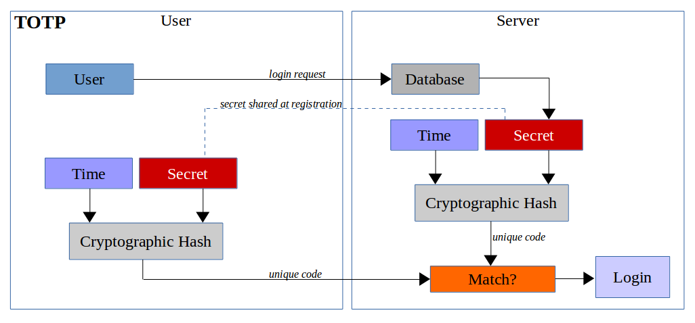

No. And if you landed on a site telling you that you could, they are lying to you and trying to steal your private keys.

[2FA / MFA](https://en.wikipedia.org/wiki/Multi-factor_authentication) is something that works for server-side applications in order to add an additional layer of security on top of the username and password.

## TOPT (Google Authenticator)

> Time-based One-time Password (TOTP), popularized mainly by Google Authenticator, verifies your identity based a secret that must be shared online between you and the provider.
>
> When logging into a website, your device generates a unique code based on the shared secret and the current time. Then you have to manually submit this code. The server generates the exact same thing, based on the same secret, in order to compare and validate the login request.

[_Source_](https://blog.trezor.io/why-you-should-never-use-google-authenticator-again-e166d09d4324)

All of this work is done so that you are _authorized_ to access the information stored on the servers of the service you are using.

## How do I traditionally access my accounts?

If you’ve used the internet, you’re familiar with the idea of logging into a site or application with a username (or email address) and password. You may additionally provide a 2FA code.
When you do this, you send your email and password to the central server, that server checks whether it is valid (the incoming information matches what is stored on the server), and either grants you access or denies you access.

### No username and password, just a private key.

When sending your ether or tokens, you’re not required to have both the public and private keys. All you need is a private key to gain access to a wallet. This creates additional risk, as a scammer or phishing site only needs to obtain that one piece of information to ruin your day/month/year/life.

### There’s no “forgot password” button.

If you ever lose your private key, there’s nothing that can be done. Because your private keys are not stored on a central server (like your username + passwords traditionally are), there is no one to recover it for you. If you lose it, it’s gone, and your assets are forever unrecoverable.

### There’s no two-factor authentication.

If someone gains access to your private key, the only thing you can do is hope you’re faster at moving assets than they are. There’s no 2FA to ensure that your key is behind another layer of protection. If you lose it, you lose it.

### No reversing transactions.

This is true for all of cryptocurrency, but it highlights the significance of keeping your keys safe (and not typing/pasting them into a browser). If someone gets a hold of your private key and sends your funds elsewhere, there’s nothing you can do.

### There is no way to change your private key.

Because all the nodes and miners all across the entire world have to play by the same cryptographic rules, there is no way to change your private key to prevent further loss once your account is compromised.

## The blockchain and MyCrypto

In the case of MyCrypto.com, a client-side application, we do not have servers in this fashion. We do not hold your keys on our servers. We do not give you access to the keys on our servers. You have the key. That key is the core piece of information that allows access to authenticate a transaction on the blockchain. While _you_ can encrypt it with a password, there is no server that can verify or track a 2FA login / [OTP](https://en.wikipedia.org/wiki/One-time_password) when you are using MyCrypto. If someone gets your private key (Keystore file, mnemonic, passwords), they have complete access to your funds. There is no stopping transactions, canceling transactions, or resetting passwords.

In order to implement 2FA, we would need to store your key and protect it on our servers. This is simply not something we want to do. If we did so, we would have a situation where anyone who gets access to our servers, your keys, or your 2FA codes gets access to the funds of every user on our servers. The bounty on hacking our servers is as large as the funds held by every user. That's a huge bounty and is dangerous.

If this is functionality that you do want, feel free to use an exchange or hosted wallet, such as Coinbase, Kraken, Poloniex, Bittrex, Bitfinex, Gemini, and so forth. Just be aware of the risk of letting someone else hold your keys and, in turn, 2FA codes for you.

## Hardware wallets

Or, you know, spend the <$100 and get a [hardware wallet](/staying-safe/hardware-wallet-recommendations). It's worth it. You can use it for 2FA on other services and ensure the safety and security of your funds.

More information: <https://github.com/kvhnuke/etherwallet/issues/292>

## Related articles

- [Security & Phishing](/staying-safe)
- [What is the Difference between an Exchange and MyCrypto?](/general-knowledge/about-mycrypto/whats-the-difference-between-an-exchange-and-mycrypto)
