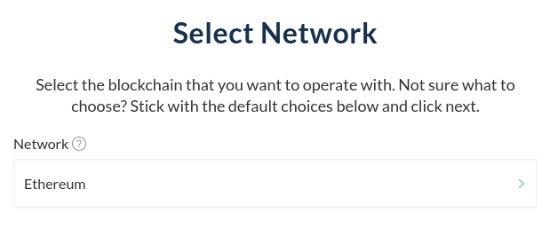

Make sure that you select the correct network before connecting your Ledger device with MyCrypto. Selecting a different network from the one you're trying to interact with might result in your account(s) not showing up.

Your funds might also be on a different [derivation path](/general-knowledge/ethereum-blockchain/what-is-a-derivation-path). While MyCrypto automatically scans various derivation paths for any accounts containing funds, it might not find every account right away. If MyCrypto is able to find one or more accounts, but the account you wish to add is still not found, you can click "Scan 10 more addresses for the selected derivation path".

Additionally, you can also click "try to scan more addresses" in case no accounts are found.

