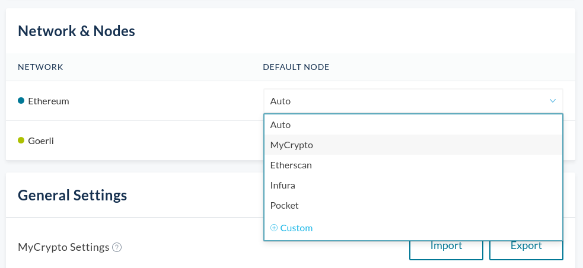

If you're able to see your balance, but it shows an incorrect amount, the node that you are connected to might be out of sync.

Nodes are servers that provide information about the blockchain. They provide your account balances, and allow you to interact with the blockchain. In case a node is out of sync, it might be stuck on an older state of the blockchain, and may return a different balance if you recently received funds on your account.

You can try to temporarily solve this issue by using a different node provider, by going to your MyCrypto settings page, and finding the Networks & Nodes settings. Keep in mind that not every network might offer multiple node providers.

If you experience this issue, please [reach out to us](/contact-us) right away and mention the network on which you are experiencing this issue on. It will help us to resolve the problem as soon as possible.
