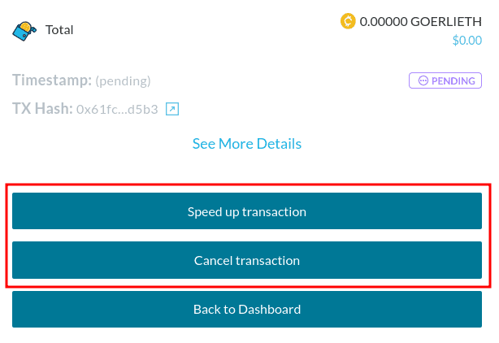

Once a transaction is mined/confirmed on the Ethereum network, it is irreversible and cannot be cancelled or refunded. Cancelling a transaction is only possible when the transaction is still pending, and hasn't been mined yet.

It's possible to cancel a pending transaction right from your MyCrypto dashboard by [checking the status of your transaction](/how-to/sending/checking-the-status-of-a-transaction), and clicking the "Cancel transaction" button. This will initiate a 0 ETH transaction which will replace the pending transaction, resulting in it cancelling the initial (still pending) transaction.
