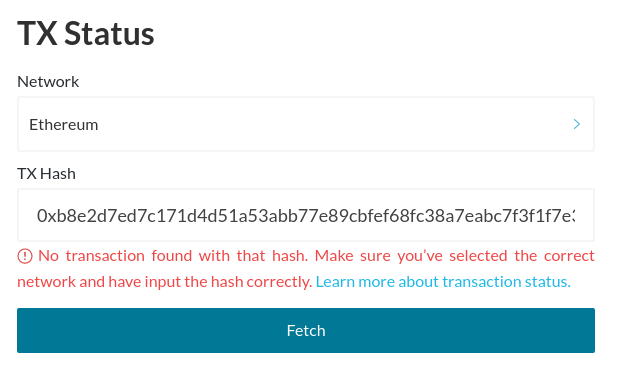

If you try to look up your transaction on MyCrypto or a blockchain explorer such as Etherscan, it might show that your transaction wasn't found. Keep in mind that transaction hashes are specific to one network only; checking the status of an ETH transaction will only work if the Ethereum network is specified, and EWT transfers will only show up on the EnergyWeb network.

You might also encounter this issue if your transaction was pending for too long, causing the network to drop your transaction. Transactions might get dropped when they use a [Gas Price](/how-to/sending/how-to-know-what-gas-price-to-use) fee that was too low, or if a wrong [Nonce](/general-knowledge/ethereum-blockchain/what-is-nonce) value was used. Often when the Ethereum network is busy, the minimum [Gas Price](/how-to/sending/how-to-know-what-gas-price-to-use) value goes up, causing older transactions with a lower Gas price value to become stale and miners never picking up these transactions.

Keep in mind that if you just sent a transaction, it might take some time for it to propagate across the network, which might cause a small delay for it to show up on Etherscan.

When your transaction wasn't found, the transaction was never mined and no funds were taken out of your account. You are safe to try and send the transaction once more.
