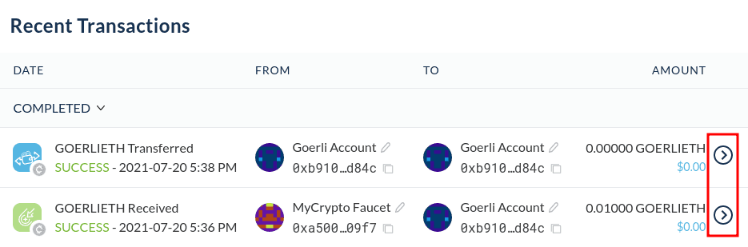
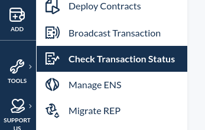

It's possible to [check the status of your transaction](/how-to/sending/checking-the-status-of-a-transaction) right from your MyCrypto interface by clicking the ">" button next to any transaction in your Recent Transaction overview;

It's also possible to check the status by going to Tools > Check Transaction status;

