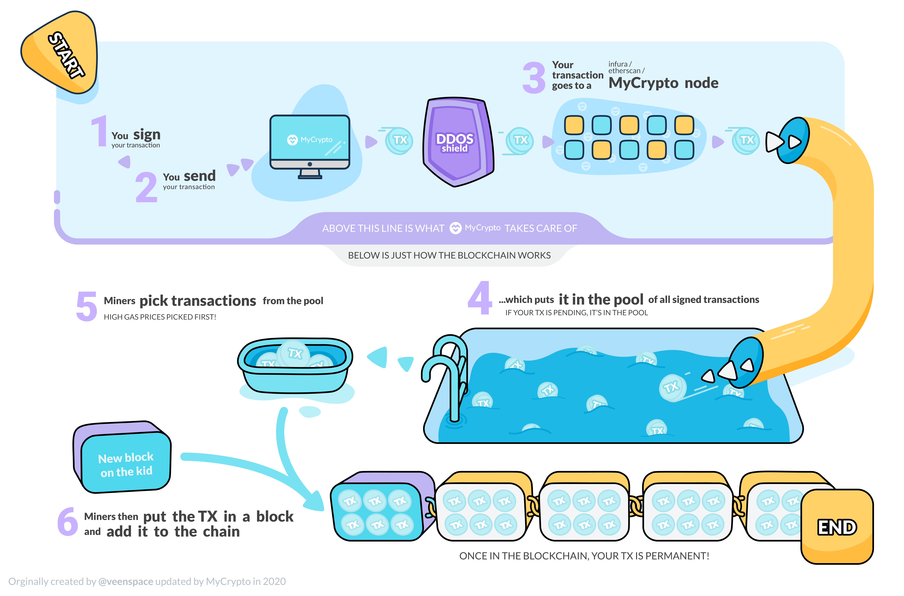

At times, combinations of new users, increased interest, or popular DeFi products can create quite a mess of the transaction pool. This sometimes results in an accumulation of pending transaction that take longer than normal to send, and is a network issue that affects all exchanges and clients.

In these cases, there is simply not enough space in the blocks for the miners to mine all the transactions, and most systems are not currently set up to monitor the massive quantity of transaction requests. This will hinder everyone's ability to send transactions, including our own.

## Helpful tools and resources to get your transaction to send

- [Replace or cancel a pending transaction](/how-to/sending/checking-or-replacing-a-transaction-after-it-has-been-sent)
- [See all the transactions that are pending here](https://etherscan.io/txsPending)
- [Learn about **Gas**, **transaction Fees**, and how to get your transaction to go through](/general-knowledge/ethereum-blockchain/what-is-gas)
- [Learn about what a **nonce** is and how it controls which transactions are mined, or not mined](/general-knowledge/ethereum-blockchain/what-is-nonce)
- [See what the **optimal gas price** for sending transactions is](https://ethgasstation.info/)

If you sent **FROM an exchange**, your best bet is to just be patient. There have been instances when we received over 1000 messages within a 24-hour period. Many exchanges have a much larger user base.

If you have any other questions, please let us know, but your answer is likely in the links above.

Thank you for understanding.

## For Visual Learners

