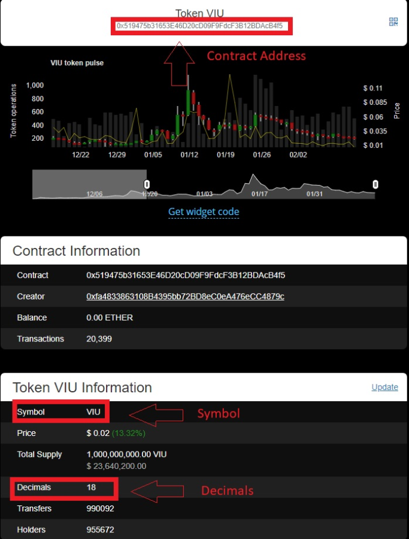

## How to add a new ERC-20 token

If you can't see a token when you access your wallet on MyCrypto, you simply just need to add it to your interface in order to see it and then send it in a transaction.

Any ERC-20 token can be added to your local MyCrypto interface by following these instructions.

1. After accessing your address, click the "Scan For Tokens" button. 

2. Your tokens should appear if the token is on our token list. If you have a balance, you won't have to load it again — it will automatically load in the future.

If your token is not on the list, click the "Add Custom Token" button which will bring up the fields below.

You can use Ethplorer or Etherscan to find out the parameters of your token. 

If there is an issue with adding a custom token, try adding it again but suffixing the name with `-1`. For example `TOK` becomes `TOK-1`.

### via [Ethplorer](https://ethplorer.io/) 

1. On the ["Send"](https://mycrypto.com/account) page on MyCrypto, click `View Address` and paste *your* address.

2. In a new tab, go to [Ethplorer.io](https://ethplorer.io/). 

3. Navigate to your address.

4. Scroll down until you see `Token Balances`.

5. Click on the token that you want to add from the tokens shown in your wallet.

6. You will be taken to a page that will you show all the information needed to add your token. Please look at the following image for further guidance.

7. Back on MyCrypto, click the `Add Custom Token` button on the right sidebar.

8. Paste the `Contract Address`, `Symbol`, and `Decimals` that you got from Ethplorer.io.

9. Click `"Save"`.

🎉You can now send your new token and see it's balance in the sidebar!

### via [Etherscan](https://etherscan.io)

1. On the ["Send"](https://mycrypto.com/account) page on MyCrypto, click `View Address` and paste *your* address.
2. In the sidebar, click the `https://etherscan.io` link under `Transaction History` or `How to See your Tokens`.
3. Click the dropdown in the upper right quadrant. It's labeled `Token Tracker`.
4. Click the token that you aren't seeing on MyCrypto.
5. Copy the string next to `Contract Address`.
6. Back on MyCrypto, click the `Add Custom Token` button on the right sidebar.
7. Paste the `Contract Address`.
8. Type in what you want to call it - the name or the symbol.
9. Return to Etherscan.io. Look for the number (between 0 and 18) next to `Token Decimals`.
10. Enter this under `Decimals` on MyCrypto.
11. Click `"Save"` on MyCrypto.

🎉 You can now send your new token and see it's balance in the sidebar!

### Removing a custom token

To remove a custom token, click the little ( - ) icon next to the token. This will remove it from the interface. It will not delete or remove the token from the wallet itself. They are still safely stored in your wallet, we promise.

### Related articles

* [Showing & Loading Custom Tokens](/troubleshooting/tokens/adding-new-token-and-sending-custom-tokens)
* [Can I store any coin in MyCrypto?](/general-knowledge/about-mycrypto/does-mycrypto-support-bitcoin-or-other-coins)
* [I am throwing a #FOMOFest (aka a token sale, token creation period, ICO) and want to add my token to MyCrypto for all my investors. What do I do?](/developers/add-token-to-default-list)
