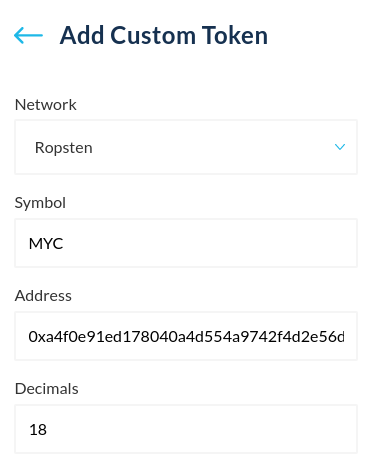

If you can't see a token when you access your address with MyCrypto, you simply need to add it as a custom token to your interface. MyCrypto ships with a list of tokens that it will automatically scan your address for, which is updated with every release. However, it may happen that a new token is not on this list just yet, in which case you will have to manually add it to your interface.

Any ERC-20 token can be added to your local MyCrypto interface by following these instructions.

After accessing your address, click the `Scan For Tokens` button, on the right-hand side of the interface.

Your tokens should appear if the token is on our token list. If you have a balance, you won't have to load it again — it will automatically load in the future.

If your token is not on the list, click the "Add Custom Token" button which will bring up the fields below.

## Adding a custom token

To add a custom token, you will have to find the contract address of the token that you would like to add. You can use Etherscan to find this address.

After accessing your address with MyCrypto, click the Etherscan link as highlighted below.

Click the token balance drop-down, and a list of tokens that your address holds will show up. Click the token that you would like to add to your MyCrypto interface.

Then, copy the contract address of this token, highlighted in red.

Enter the contract address in the `Address` field. You will notice that the `Decimals` and `Token Symbol` fields will be filled in for you automatically.

If there is an issue with adding a custom token, try adding it again but suffixing the name with `-1`. For example, `MYC` becomes `MYC-1`.

Click the `Save` button, and your custom token will now be shown in your interface. You can now interact with it like any other token.

## Removing a custom token

To remove a custom token, click the ( - ) icon next to the token. This will remove it from the interface.

On [beta.mycrypto.com](https://beta.mycrypto.com/), you can hide token balances without removing them completely by expanding the Balance Breakdown and clicking the ( - ) icon to hide them. You can un-hide tokens in the Settings page.

Removing custom tokens and hiding tokens will merely remove the visibility of these tokens. It will not delete or remove the token from the address itself

## Related articles

* [Can I store any coin in MyCrypto?](/general-knowledge/about-mycrypto/does-mycrypto-support-bitcoin-or-other-coins)
* [Adding a token as a default token in MyCrypto](/developers/add-token-to-default-list)
