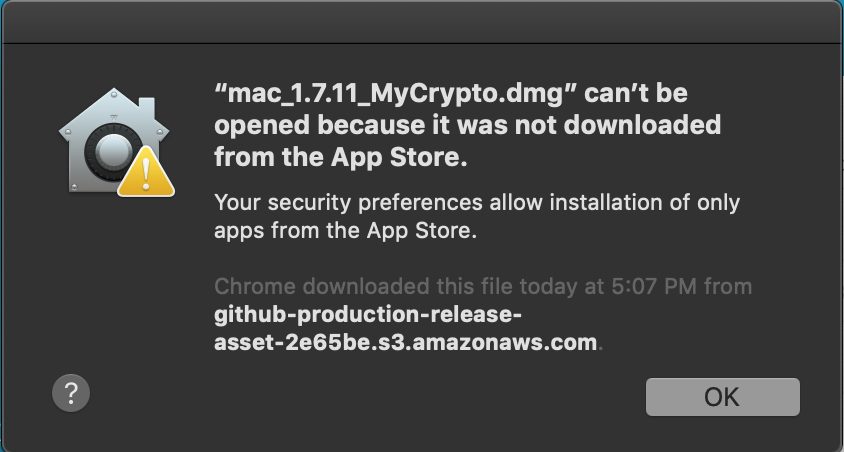
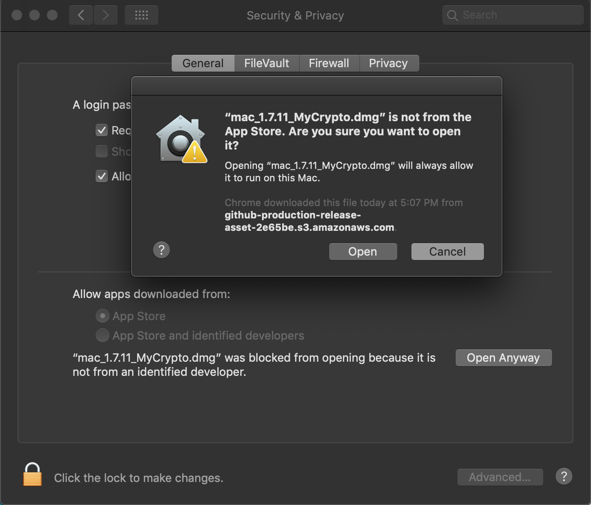
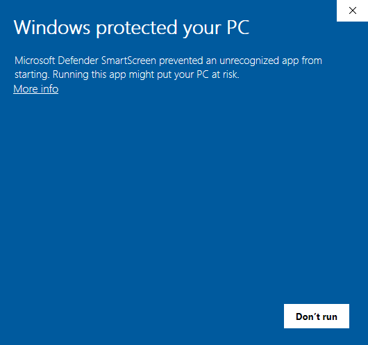
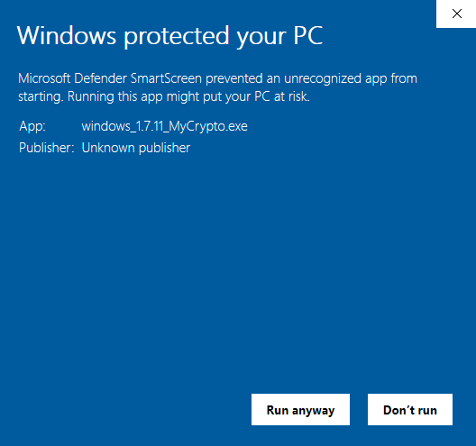

When installing apps from third-party developers (like MyCrypto), your operating system may put up a roadblock that attempts to dissuade you from installing it. This roadblock is generally a good thing, as it does help keep users safe from installing harmful applications, though there are instances where the application is not harmful and is simply published by a developer (like MyCrypto) that isn’t officially recognized by that operating system.

This article will help you move past this roadblock so you can begin using the MyCrypto Desktop Application.

<Accordion>
<AccordionItem title="macOS">

When attempting to install the MyCrypto Desktop App on macOS, some users will see this popup, stating:

> mac.1.7.11_MyCrypto.dmg” *(or whichever version number you’re installing)* can’t be opened because it was not downloaded from the App Store. Your security preferences allow installation of only apps from the App Store.

There are a few ways to bypass this.

* Try right-clicking the file icon and clicking "Open"
* A similar popup will appear but, this time, will have the option to continue with installation.

If that doesn't work:

* Try moving the file to your desktop, hold down "Control/Command" on your keyboard, and then left-click the file.

If that doesn't work:

* Try installing the file normally and then, after the above message pops up, go to System Preferences > Security and Privacy > General. Then you should see an option on the bottom that says “Open Anyway.” 
* Click this and a prompt to install MyCrypto will appear. 

</AccordionItem>
<AccordionItem title="Windows">

When attempting to install the MyCrypto Desktop App on Windows, some users will see this popup, stating:

> Windows protected your PC
> 
> Microsoft Defender SmartScreen prevented an unrecognized app from starting. Running this app might put your PC at risk.

To bypass this, click “More info.”

You’ll then be met with the following screen, giving more information about the application and the publisher.

Note that MyCrypto is an ‘unknown publisher,’ and when installing the MyCrypto Desktop App, you should always follow the instructions to [verify the authenticity of the application](/staying-safe/verifying-authenticity-of-desktop-app).

Click “Run anyway” and the application will begin to install appropriately.

</AccordionItem>
</Accordion>

## A note on application verification and security

The security roadblocks that operating systems have in place are there for a good reason and protect you from potentially harmful applications.

There are people out there who will make fake versions of real applications, and those fake versions are intended to steal your private keys and steal your cryptocurrency.

You should always [verify the authenticity](/staying-safe/verifying-authenticity-of-desktop-app) of any application that you download, including the MyCrypto Desktop App. 

And as always, do everything that you can to [keep yourself and your funds secure](/staying-safe/protecting-yourself-and-your-funds).
